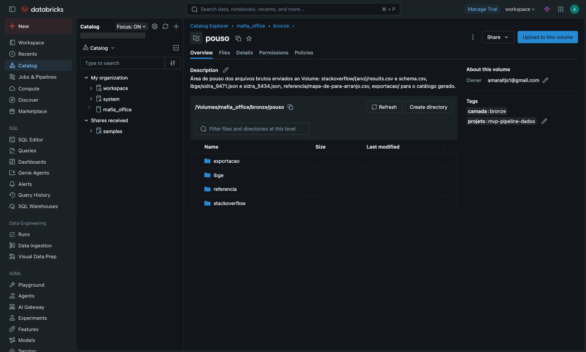
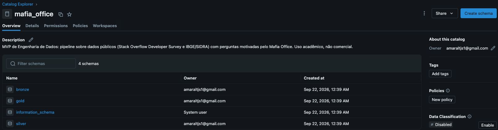
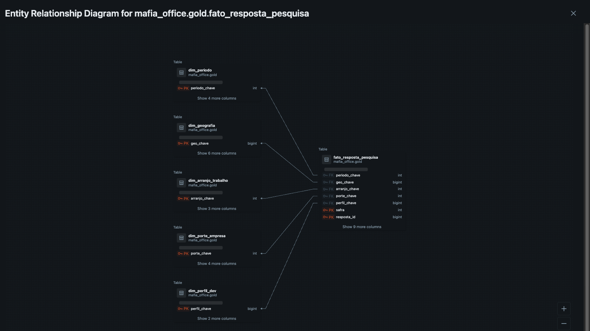
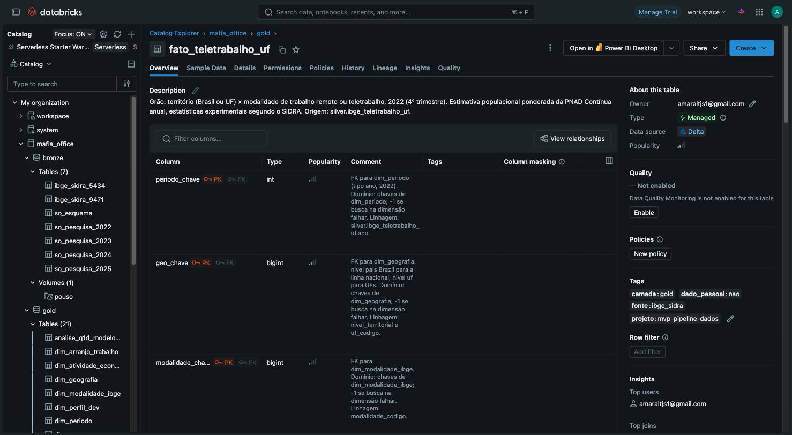
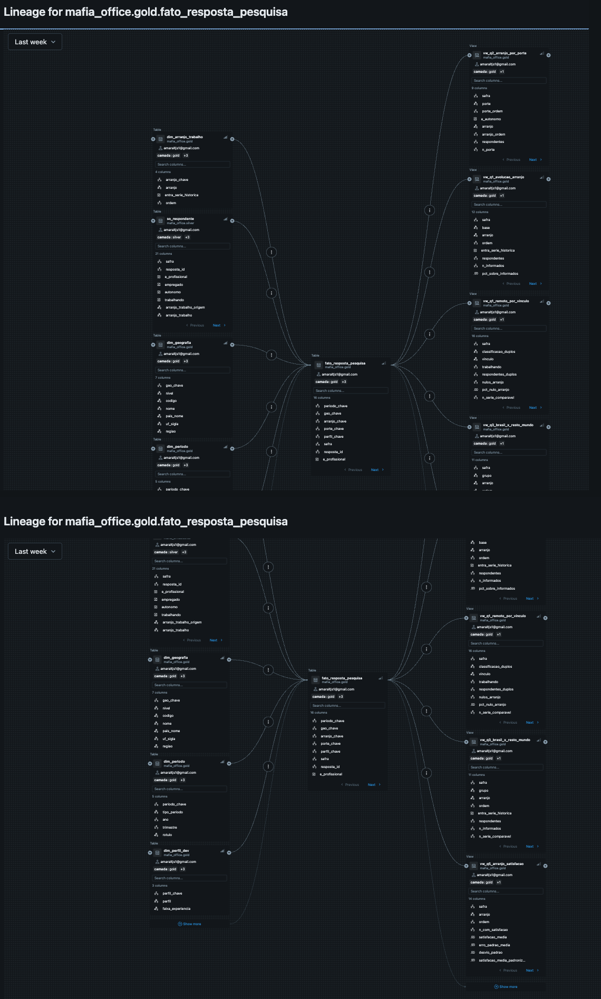
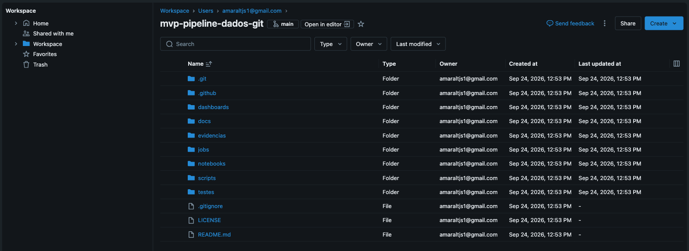
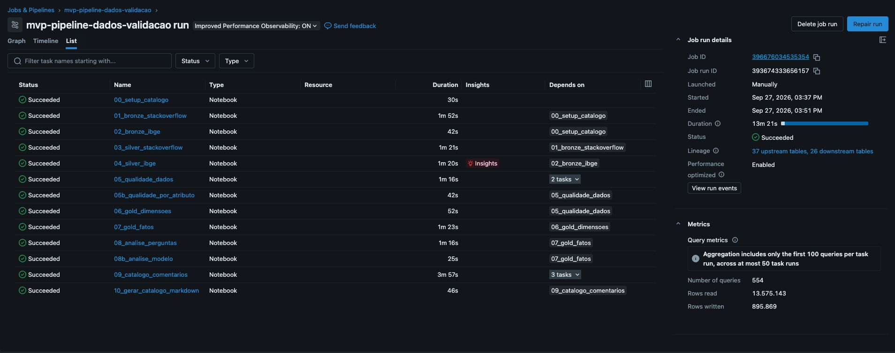
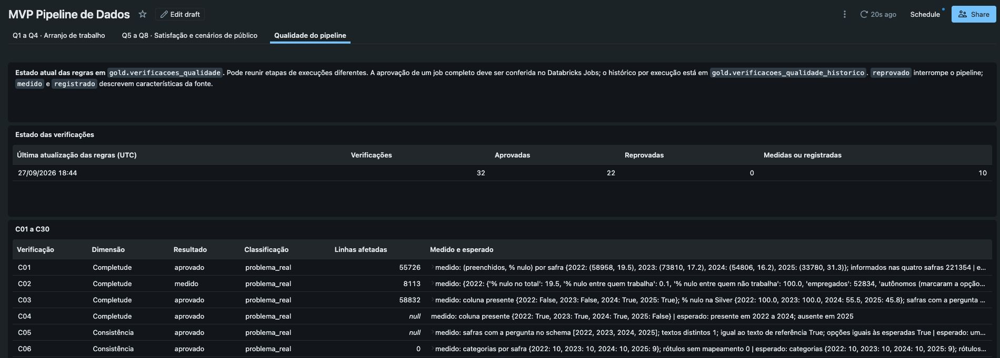
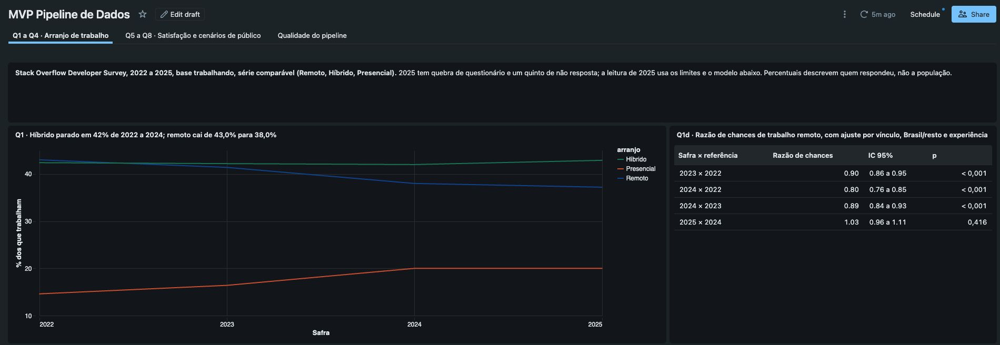

# Trabalho remoto e híbrido em tecnologia: pipeline de dados na nuvem com a Stack Overflow Developer Survey e a PNAD Contínua

**Gabriel Soares Ferreira do Amaral**

Pós-graduação em Ciência de Dados, PUC-Rio. MVP da disciplina de Engenharia de Dados.

Repositório da entrega: [mvp-engenharia-dados](https://github.com/amarok30/mvp-engenharia-dados).

Databricks Free Edition. Execução documentada: job 396676034535354, execução 393674333656157, 27/09/2026, commit `33625e9`. As 13 tarefas foram concluídas com sucesso. O [registro da execução](evidencias/execucao-validada.json) identifica as versões das tabelas e os arquivos exportados.

**Leitura do projeto:** [objetivo e fontes](#1-contexto-de-negócios-e-perguntas-etapas-2-e-41) · [modelagem](#3-modelagem-e-catálogo-de-dados-etapa-43) · [pipeline](#4-pipeline-de-dados-etapa-44) · [qualidade](#5-qualidade-de-dados-etapa-45) · [resultados Q1 a Q8](#6-análise-de-dados-etapa-45) · [autoavaliação](#7-autoavaliação).

Para conferir a execução, consulte os [notebooks com saídas](docs/notebooks-html/) e os [resultados em CSV](evidencias/views/).
O [roteiro de reprodução](docs/roteiro-databricks.md) reúne os comandos e os requisitos do ambiente.

## RESUMO

Este trabalho constrói um pipeline no Databricks para investigar o público de uma ferramenta de colaboração para
times remotos e híbridos. Integra a Stack Overflow Developer Survey, de 2022 a 2025, e duas tabelas da PNAD Contínua
do IBGE em camadas Bronze, Silver e Gold, com três tabelas fato e sete dimensões documentadas no Unity Catalog.
Trinta famílias de verificações de qualidade controlam a carga. Entre os respondentes que trabalham, o regime remoto
ou híbrido caiu de 85,4% em 2022 para 80,0% em 2024. A queda veio do remoto integral; o modelo mantém a associação
após ajuste por vínculo, indicador Brasil/resto do mundo e experiência. Na amostra, empresas grandes apresentam mais
trabalho híbrido e os brasileiros, mais remoto integral. A satisfação média com o emprego é maior entre remotos e
híbridos que entre presenciais, mas não mede as necessidades específicas de colaboração. Para o Brasil, quatro
cenários de transferência das taxas do IBGE ao setor proxy produzem de 893,6 mil a 1.241,9 mil pessoas em 2022.
Esses valores dependem das premissas adotadas e não medem compradores ou demanda pelo produto.

**Palavras-chave:** engenharia de dados; arquitetura medalhão; Databricks; trabalho remoto; PNAD Contínua.

## 1 CONTEXTO DE NEGÓCIOS E PERGUNTAS (ETAPAS 2 E 4.1)

### 1.1 Problema

O Mafia Office é um escritório virtual 3D para times remotos e híbridos, em pré-lançamento, com foco inicial no Brasil.
Antes de investir no produto, três dúvidas precisam de resposta: se o público existe e de que tamanho, quem é o cliente
ideal e se a dor que o produto quer resolver aparece nos dados. O objetivo do MVP é levar dados públicos do estado bruto
até tabelas que respondam a essas dúvidas.

### 1.2 Perguntas

**Quadro 1 - Perguntas de negócio**

| # | Pergunta | Fonte | Decisão que apoia |
|---|---|---|---|
| Q1 | Como evoluiu a distribuição entre remoto, híbrido e presencial de 2022 a 2025? | Stack Overflow | Seguir com o produto |
| Q2 | O arranjo de trabalho varia com o porte da empresa? | Stack Overflow | Cliente ideal |
| Q3 | Como o Brasil se compara ao resto do mundo? | Stack Overflow | Foco geográfico |
| Q4 | Que perfis e faixas de experiência concentram o trabalho remoto? | Stack Overflow | Mensagem de venda |
| Q5 | Existe relação entre arranjo de trabalho e satisfação com o emprego? | Stack Overflow (2024 e 2025) | Contexto da experiência de trabalho |
| Q6 | Qual o tamanho e a distribuição do teletrabalho no Brasil? | IBGE, tabela 9471 | Onde concentrar esforço |
| Q7 | Como evoluiu a ocupação no setor proxy de tecnologia por UF? | IBGE, tabela 5434 | Tendência da base |
| Q8 | Que cenários de público no Brasil resultam do cruzamento das fontes? | IBGE, tabelas 9471 e 5434 | Ordem de grandeza sob premissas explícitas |

Fonte: o autor (2026).

Como o produto atende times remotos e híbridos, as análises olham o remoto, o híbrido e a soma dos dois, chamada aqui
de não presencial. A Q3 fica no total do país: das 649 respostas brasileiras com arranjo informado em 2025,
586 entram no recorte comparável de quem trabalha. A Q5 vale só para 2024 e 2025, quando a pergunta de satisfação
(`JobSat`) está disponível. A Q8 apresenta cenários condicionais à transferência de taxas entre universos diferentes.

### 1.3 Dados brutos e licenças

**Quadro 2 - Fontes de dados**

| Fonte | Conteúdo | Estrutura | Licença |
|---|---|---|---|
| Stack Overflow Developer Survey, 2022 a 2025 | Pesquisa anual de adesão voluntária, uma linha por resposta | `results.csv` e `schema.csv` por ano; 73.268, 89.184, 65.437 e 49.191 linhas; 79, 84, 114 e 172 colunas | ODbL 1.0 (base) e DbCL 1.0 (conteúdo) |
| IBGE, PNAD Contínua, tabela 9471 | Ocupados em trabalho remoto e teletrabalho, 4º trimestre de 2022 (estatística experimental) | JSON da API do SIDRA, 673 registros | Dado público, com citação da fonte |
| IBGE, PNAD Contínua, tabela 5434 | Ocupados por grupamento de atividade, por trimestre | JSON da API do SIDRA, 20.359 registros | Dado público, com citação da fonte |

Fonte: o autor (2026), com base em Stack Overflow (2025) e IBGE (2023).

Da pesquisa são usadas dez colunas: `ResponseId`, `MainBranch`, `Employment`, `RemoteWork`, `Country`, `OrgSize`,
`DevType`, `YearsCode`, `ConvertedCompYearly` e `JobSat`. Do SIDRA, território, período, classificação, variável e
valor. O detalhe de cada coluna bruta está no [catálogo da Bronze](docs/catalogo-bronze.md), e o das licenças, em
[`docs/licencas-e-fontes.md`](docs/licencas-e-fontes.md).

A pesquisa mostra tendência e perfil, mas não representa a população. O IBGE mostra tamanho e distribuição, com amostra
probabilística, mas sem perfil. "Remoto" na pesquisa e "teletrabalho" no IBGE são conceitos diferentes, e as fontes
nunca são somadas.

## 2 CARGA DOS DADOS (ETAPA 4.2)

A Free Edition bloqueia quase toda a saída para a internet. Por isso a carga segue três passos:

1. [`scripts/baixar_fontes.sh`](scripts/baixar_fontes.sh) baixa os arquivos localmente e confere tamanho e formato. O
   registro de endereço, tamanho e sha256 da extração de 13/09/2026 está em [`evidencias/EXTRACAO.txt`](evidencias/EXTRACAO.txt);
2. os arquivos são enviados ao Volume `mafia_office.bronze.pouso` do Unity Catalog;
3. os notebooks 01 e 02 leem o Volume e gravam a Bronze, tudo como texto e sem alterar valores. O notebook confere
   linhas e colunas de cada ano (277.080 linhas no total) e para se algo divergir.

**Figura 1 - Volume de pouso no Catalog Explorer**

Fonte: o autor (2026).

## 3 MODELAGEM E CATÁLOGO DE DADOS (ETAPA 4.3)

### 3.1 Camadas

Cada camada da arquitetura medalhão (Databricks, 2026b) é um schema do catálogo `mafia_office`.

**Quadro 3 - Tabelas por camada**

| Camada | Tabelas | Conteúdo |
|---|---|---|
| Bronze (7) | `so_pesquisa_2022` a `so_pesquisa_2025`, `so_esquema`, `ibge_sidra_9471`, `ibge_sidra_5434` | Dado como veio da fonte, com colunas de controle da carga |
| Silver (5) | `so_respondente`, `so_de_para_arranjo`, `so_metadados_pergunta`, `ibge_teletrabalho_uf`, `ibge_ocupados_uf_atividade` | Dado limpo, tipado e padronizado entre os anos |
| Gold (23 objetos) | 7 dimensões, 3 tabelas fato, 9 views das perguntas e 4 tabelas de apoio (qualidade e modelo da Q1) | Modelo dimensional e análises |

Fonte: o autor (2026).

**Figura 2 - Schemas do catálogo mafia_office no Unity Catalog**

Fonte: o autor (2026). Captura da interface do Databricks em 27 set. 2026.

### 3.2 Modelo dimensional

O modelo é uma constelação de fatos (Kimball Group, 2013): três tabelas fato, uma por processo, ligadas pelas dimensões
conformadas `dim_periodo` e `dim_geografia`.

**Quadro 4 - Grão das tabelas fato**

| Tabela fato | Uma linha por | Dimensões |
|---|---|---|
| `fato_resposta_pesquisa` | respondente em cada ano da pesquisa | período, geografia, arranjo, porte, perfil |
| `fato_teletrabalho_uf` | território (Brasil ou UF) e modalidade, 4º trimestre de 2022 | período, geografia, modalidade |
| `fato_ocupacao_uf_atividade` | UF, trimestre e grupamento de atividade | período, geografia, atividade |

Fonte: o autor (2026).

**Figura 3 - Constelação de fatos da Gold**

Fonte: o autor (2026).

As chaves primárias e estrangeiras estão declaradas no Unity Catalog, que gera o diagrama de relacionamento.

**Figura 4 - Diagrama de relacionamento da `fato_resposta_pesquisa`**

Fonte: o autor (2026).

Três decisões afetam a leitura dos números. As classificações de arranjo das duas fontes ficam em dimensões separadas,
porque medem conceitos diferentes. Nenhuma linha se perde nos `JOIN`, porque toda dimensão tem o membro
`-1 / Desconhecido`. E um de-para por ano ([`docs/mapa-de-para-arranjo.csv`](docs/mapa-de-para-arranjo.csv))
padroniza as opções de arranjo, que mudaram em 2023 e em 2025. O modelo coluna a coluna está em
[`docs/modelo-dimensional.md`](docs/modelo-dimensional.md), e as decisões, em [`docs/decisoes.md`](docs/decisoes.md).

### 3.3 Catálogo de dados

O catálogo fica no Unity Catalog. Cada coluna, da Bronze à Gold, tem descrição, domínio de valores e linhagem; o tipo
vem do próprio catálogo. As tabelas têm tags de camada, fonte, licença e dado pessoal.

**Figura 5 - Descrição das colunas e tags de uma tabela da Gold**

Fonte: o autor (2026).

Os [domínios observados na captura](docs/dominios-captura.json) distinguem categorias encontradas e limites numéricos
das regras admissíveis para futuras cargas. Nos campos de múltipla seleção identificados pelo esquema da safra,
as opções são enumeradas separadamente das combinações de respostas. O catálogo transcrito está em [`docs/catalogo-de-dados.md`](docs/catalogo-de-dados.md) (Silver e Gold) e
[`docs/catalogo-bronze.md`](docs/catalogo-bronze.md), gerados pelo notebook 10. A linhagem capturada pelo Unity Catalog
está exportada em [`evidencias/linhagem-unity-catalog.csv`](evidencias/linhagem-unity-catalog.csv) (tabelas) e
[`evidencias/linhagem-colunas-unity-catalog.csv`](evidencias/linhagem-colunas-unity-catalog.csv) (colunas). A regra de
cada transformação está em [`docs/linhagem.md`](docs/linhagem.md).

**Figura 6 - Linhagem de uma tabela da Gold**

Fonte: o autor (2026).

## 4 PIPELINE DE DADOS (ETAPA 4.4)

O pipeline roda no Databricks Free Edition, com compute serverless, PySpark e SQL, sobre tabelas Delta. É ramificado em
treze notebooks, um por etapa, cada um com um cabeçalho que diz o que lê, o que grava e as decisões tomadas.

**Quadro 5 - Notebooks do pipeline**

| # | Notebook | Lê | Grava |
|---|---|---|---|
| 00 | [`00_setup_catalogo.sql`](notebooks/00_setup_catalogo.sql) | nada | catálogo, schemas e Volume |
| 01 | [`01_bronze_stackoverflow.py`](notebooks/01_bronze_stackoverflow.py) | CSVs do Volume | `bronze.so_pesquisa_*` e `bronze.so_esquema` |
| 02 | [`02_bronze_ibge.py`](notebooks/02_bronze_ibge.py) | JSONs do Volume | `bronze.ibge_sidra_*` |
| 03 | [`03_silver_stackoverflow.py`](notebooks/03_silver_stackoverflow.py) | Bronze da pesquisa e de-para | `silver.so_*` |
| 04 | [`04_silver_ibge.py`](notebooks/04_silver_ibge.py) | Bronze do IBGE | `silver.ibge_*` |
| 05 | [`05_qualidade_dados.py`](notebooks/05_qualidade_dados.py) | Bronze e Silver | `gold.verificacoes_qualidade` |
| 05b | [`05b_qualidade_por_atributo.py`](notebooks/05b_qualidade_por_atributo.py) | Perfis da captura e Silver | `gold.qualidade_por_atributo` |
| 06 | [`06_gold_dimensoes.sql`](notebooks/06_gold_dimensoes.sql) | Silver | 7 dimensões |
| 07 | [`07_gold_fatos.sql`](notebooks/07_gold_fatos.sql) | Silver e dimensões | 3 tabelas fato |
| 08 | [`08_analise_perguntas.sql`](notebooks/08_analise_perguntas.sql) | Gold | 9 views das perguntas |
| 08b | [`08b_analise_modelo.py`](notebooks/08b_analise_modelo.py) | Gold | modelo logístico da Q1 |
| 09 | [`09_catalogo_comentarios.sql`](notebooks/09_catalogo_comentarios.sql) | metadados | descrições e tags |
| 10 | [`10_gerar_catalogo_markdown.py`](notebooks/10_gerar_catalogo_markdown.py) | `information_schema` | catálogo em Markdown |

Fonte: o autor (2026).

As saídas da execução documentada estão em [`docs/notebooks-html/`](docs/notebooks-html/). O código fica neste repositório,
ligado ao workspace por uma pasta Git.

**Figura 7 - Pasta Git ligada ao repositório**

Fonte: o autor (2026).

A definição do job `mvp-pipeline-dados` ([`jobs/pipeline.json`](jobs/pipeline.json)) aponta para a branch
`main`. A versão revisada foi validada em um job separado, a partir da branch `codex/revisao-final-mvp`, com os mesmos treze notebooks. As duas fontes seguem em paralelo até a Silver. Uma tarefa que falha é repetida uma vez; se falhar de novo, as
seguintes não rodam e um e-mail é enviado.

Três escolhas dão confiabilidade à carga:

- **carga completa e reexecutável:** cada execução substitui a tabela inteira, sem acumular linhas. Duas execuções
  locais sobre os mesmos arquivos deram conteúdo idêntico nas 18 tabelas da Silver e da Gold;
- **dado inválido não entra:** a Silver confere as regras de cada coluna antes de gravar e para se alguma falhar. As
  regras ficam também nas tabelas como `CHECK` e `NOT NULL` (Databricks, 2026a);
- **validação em dois ambientes:** os testes locais verificam transformações com Spark e Delta; a execução no
  Databricks verifica a integração com o Unity Catalog e o job ([`testes/`](testes/)). O executor local tem adaptações
  documentadas e não reproduz integralmente os recursos da nuvem.

O histórico preserva os resultados produzidos por cada etapa antes de uma reprovação e evita duplicatas nas repetições.
O estado completo da execução é conferido no Databricks Jobs; ausência de reprovação em um histórico parcial não prova sucesso.

A suíte local aprovou 35 testes. Na nuvem, as 13 tarefas da [execução documentada](https://dbc-90a65ce2-7728.cloud.databricks.com/?o=7474658598244241#job/396676034535354/run/393674333656157) concluíram com sucesso. A captura a seguir identifica a execução e o resultado das 13 tarefas. Os HTMLs, CSVs e o [manifesto](evidencias/execucao-validada.json) permitem conferir os resultados e a integridade dos arquivos.

**Figura 8 - Execução final com as 13 tarefas concluídas**

Fonte: o autor (2026). Captura da interface do Databricks em 27 set. 2026.

O passo a passo de reprodução está em [`docs/roteiro-databricks.md`](docs/roteiro-databricks.md).

## 5 QUALIDADE DE DADOS (ETAPA 4.5)

A qualidade é medida de duas formas, segundo as dimensões da DAMA (Black; Van Nederpelt, 2020).

**Por problema.** Trinta famílias de verificações (C01 a C30) produzem 32 resultados, pois C15 é desdobrada nas três tabelas
fato. Os resultados esperados são definidos antes da execução e os resultados medidos são gravados em `gold.verificacoes_qualidade`. Se alguma for reprovada, o pipeline para. Na execução final, nenhuma foi
reprovada. A lista completa está em [`docs/qualidade.md`](docs/qualidade.md).

**Figura 9 - Estado das verificações no dashboard de qualidade**

Fonte: o autor (2026). Captura da interface do Databricks em 27 set. 2026.

**Por atributo.** O notebook 05b reúne 580 atributos: 520 da Bronze e 60 da Silver, incluindo as colunas de controle.
Cada dimensão recebe uma medida ou uma justificativa quando não se aplica ou não pode ser verificada
([`docs/qualidade-por-atributo.md`](docs/qualidade-por-atributo.md)).
Na Silver, nenhuma chave tem repetição, e
todas as regras de consistência passam em 100%, exceto em 4 nomes de pergunta com espaço. Entre os atributos analíticos
dos respondentes, as menores completudes são `satisfacao_trabalho` (20,1%), que só existe em 2024 e 2025, e `remuneracao_usd` (48,2%), que também concentra os
outliers (6.825 respostas). Nas colunas de sinais convencionais do IBGE, completudes menores indicam principalmente
a ausência de um sinal especial; isso não significa ausência do valor numérico correspondente.

**Quadro 6 - Principais problemas e tratamento**

| Problema | Verificação | Tratamento |
|---|---|---|
| Opções da pergunta de arranjo mudaram em 2023 e 2025, com o mesmo texto | C05 | De-para por ano |
| Em 2025, 19,8% de quem trabalha deixou o arranjo em branco (até 0,1% antes) | C02, C26 | Análise de sensibilidade e modelo na Q1 |
| De 2022 a 2024, o arranjo em branco concentra-se em quem não trabalha; até 0,1% de ausência entre quem trabalha | C01, C02 | Análises só com quem trabalha |
| Rótulo de "empregado" mudou em 2025 | `Employment` | Regra que aceita os dois rótulos |
| `JobSat` não existe em 2022 e 2023 | C03 | Q5 só em 2024 e 2025 |
| 2025 junta as faixas de porte 2 a 9 e 10 a 19 | C06 | Faixa única "Menos de 20" |
| Remuneração de 1 a 16 milhões de dólares | C11, C19 | Extremos marcados, nunca apagados; análise pela mediana |
| `ResponseId` se repete entre os anos | C09 | Chave composta `(safra, resposta_id)` |
| Sinais do IBGE (`-`, `..`, `...`, `x`) no lugar de número | C18, C27 | Tratamento conforme as normas do IBGE |
| Categorias do IBGE sobrepostas | C23, C24 | Hierarquia nas dimensões, sem somar níveis |
| Coeficiente de variação alto em UFs pequenas | C13 | Conclusões só com CV até 15% |
| 182 linhas a mais no CSV de 2025 do que a metodologia publica | C16, C29 | Causa não identificada; diferença registrada |

Fonte: o autor (2026).

## 6 ANÁLISE DE DADOS (ETAPA 4.5)

A base dos percentuais da pesquisa é quem trabalha (empregado ou autônomo). Os intervalos de 95% das proporções são de
Wilson (1927) e cobrem só o erro aleatório, não o viés de quem escolhe responder. As tabelas completas estão em
[`docs/analise-detalhada.md`](docs/analise-detalhada.md). A [definição do dashboard](dashboards/mvp-pipeline-dados.lvdash.json) corresponde à versão publicada em 27/09/2026; suas 12 consultas foram executadas e conferidas.

**Figura 10 - Dashboard publicado: evolução do arranjo e modelo ajustado**

Fonte: o autor (2026). Captura da interface do Databricks em 27 set. 2026.

As capturas complementares mostram [porte da empresa e comparação entre Brasil e resto do mundo (Q2 e Q3)](evidencias/print-15-dashboard-q2-q3.png), [perfis profissionais (Q4)](evidencias/print-16-dashboard-q4.png), [satisfação por arranjo (Q5)](evidencias/print-10-dashboard-q5-q8.png), [teletrabalho por UF (Q6)](evidencias/print-17-dashboard-q6.png) e [ocupação e cenários de público (Q7 e Q8)](evidencias/print-11-dashboard-cenarios.png). Os arquivos registram o estado observado em 27 set. 2026. Os recortes mostram os painéis, com títulos, eixos e legendas, sem os menus e avisos externos da interface.

### 6.1 Q1: evolução do arranjo de trabalho

O remoto caiu de 43,0% em 2022 para 38,0% em 2024 e ficou em 37,2% em 2025. O híbrido variou entre 42,0% e
42,9%. O presencial subiu de 14,6% para 20,0%. O não presencial foi de 85,4% em 2022 para 80,0% em 2024.

**Figura 11 - Arranjo de trabalho, 2022 a 2025**

Fonte: o autor (2026), a partir de `gold.vw_q1_evolucao_arranjo`.

Em 2025 mudaram as opções da pergunta e a não resposta subiu para 19,8% de quem trabalha. Conforme a leitura da opção
nova (Your choice), o não presencial de 2025 fica entre 70,2% e 82,5%. Um modelo logístico estima a associação com a
safra após ajuste por vínculo, indicador Brasil/resto do mundo e faixa de experiência, com erros-padrão corrigidos
pela dispersão. O modelo não controla separadamente cada país nem corrige a seleção dos respondentes.

**Tabela 1 - Razão de chances de trabalhar remoto**

| Comparação | Razão de chances | Intervalo de 95% |
|---|---|---|
| 2024 contra 2022 | 0,80 | 0,76 a 0,85 |
| 2025 contra 2024 | 1,03 | 0,96 a 1,11 |

Fonte: o autor (2026), a partir de `gold.analise_q1d_modelo_logistico`.

Na amostra, as chances de remoto em 2024 foram cerca de 20% menores que em 2022, após os ajustes do modelo.
O contraste de 2025 com 2024 não apresentou diferença detectável (p = 0,416; IC95% de 0,957 a 1,111).
O intervalo admite redução ou aumento das chances; esse resultado não demonstra equivalência entre os anos.

### 6.2 Q2: arranjo por porte da empresa

Comparando os extremos de porte, o não presencial é maior nas empresas grandes: em 2022, de 79,4% nas empresas com menos de 20 pessoas a 92,7% nas com
10.000 ou mais; em 2025, de 66,4% a 73,0%. O híbrido tende a aumentar com o porte (de 28,8% para 47,5% em 2025). O
presencial pesa mais nas pequenas.

**Figura 12 - Arranjo de trabalho por porte, 2025**

Fonte: o autor (2026), a partir de `gold.vw_q2_arranjo_por_porte`.

Evidência no Databricks: [captura do dashboard publicado (Q2, painel à direita)](evidencias/print-15-dashboard-q2-q3.png), em 27 set. 2026.

O resultado sugere investigar empresas grandes com trabalho híbrido. `OrgSize` mede o porte da empresa, e não o
tamanho de cada equipe. A preferência comercial por times pequenos exige validação própria.

### 6.3 Q3: Brasil e resto do mundo

O não presencial no Brasil fica de 3,0 a 4,1 pontos acima do resto do mundo (83,6% contra 80,6% em 2025). A diferença
maior está no tipo de arranjo: o respondente brasileiro é mais remoto (58,4% contra 37,1% em 2025) e menos híbrido.

**Figura 13 - Remoto e não presencial no Brasil e no resto do mundo**

Fonte: o autor (2026), a partir de `gold.vw_q3_brasil_x_resto_mundo`.

Evidência no Databricks: [captura do dashboard publicado (Q3, painel à esquerda)](evidencias/print-15-dashboard-q2-q3.png), em 27 set. 2026.

Uma explicação possível é que o brasileiro que responde a uma pesquisa em inglês trabalha mais para empresas do
exterior. A amostra é pequena (586 respostas em 2025). O Brasil segue como mercado inicial, com público mais remoto do
que híbrido.

### 6.4 Q4: perfis e experiência

Em 2025, entre os perfis com pelo menos 100 respostas, o não presencial é maior em engenharia de infraestrutura em
nuvem (90,9%), DevOps (89,4%) e gestão de engenharia (87,2%), e menor em administração de sistemas (55,3%). Os
fundadores são o perfil mais remoto (52,9%). O remoto sobe com a experiência, de 29,3% entre quem programa há até 2
anos a 42,0% entre quem programa há 21 anos ou mais.

**Figura 14 - Remoto e híbrido por perfil, 2025**

Fonte: o autor (2026), a partir de `gold.vw_q4_perfil_remoto`.

Evidência no Databricks: [captura do dashboard publicado (Q4, perfis mais e menos remotos)](evidencias/print-16-dashboard-q4.png), em 27 set. 2026.

Fundadores e profissionais de infraestrutura são segmentos possíveis para entrevistas. O poder de decisão de compra
não foi medido nesta análise. Perfil, vínculo e experiência também não foram controlados entre si na Q4.

### 6.5 Q5: arranjo e satisfação

Na escala de 0 a 10, a nota média em 2024 foi 7,07 no remoto, 6,94 no híbrido e 6,63 no presencial; em 2025, 7,34,
7,14 e 6,99. Ajustada por experiência, a distância entre remoto e presencial é de 0,15 desvio-padrão em 2024 e 0,13 em
2025, um efeito pequeno.

**Figura 15 - Satisfação média por arranjo, 2024 e 2025**

Fonte: o autor (2026), a partir de `gold.vw_q5_arranjo_satisfacao`.

As necessidades que o produto pretende atender (isolamento, coordenação, excesso de reuniões e cultura) não são
medidas por estas fontes. A maior satisfação geral observada pode coexistir com dificuldades de colaboração.
Os resultados não sustentam a alegação de insatisfação geral com o trabalho remoto nem validam a necessidade do produto.

### 6.6 Q6: teletrabalho no Brasil

No 4º trimestre de 2022, das 96.695 mil pessoas ocupadas, 9.462 mil fizeram trabalho remoto (9,8%) e 7.399 mil,
teletrabalho (7,7%). São Paulo, Rio de Janeiro e Minas Gerais somam 54,9% do teletrabalho. A maior taxa é a do
Distrito Federal (16,7%). Das 27 UFs, 23 têm estimativa precisa (CV até 15%).

**Figura 16 - Teletrabalho por UF, 2022**

Fonte: o autor (2026), a partir de `gold.vw_q6_teletrabalho_uf`.

Evidência no Databricks: [captura do dashboard publicado (Q6, taxas por UF e precisão das estimativas)](evidencias/print-17-dashboard-q6.png), em 27 set. 2026.

São Paulo e Rio de Janeiro são o ponto de partida pelo volume, e o Distrito Federal, pela taxa.

### 6.7 Q7: ocupação no setor proxy de tecnologia

A tabela 5434 não separa tecnologia. A aproximação é o grupamento de informação, comunicação e atividades financeiras,
imobiliárias, profissionais e administrativas, mais amplo que TI. Ele foi de 9.488 mil ocupados no 1º trimestre de
2012 para 13.214 mil no 2º trimestre de 2026. Na média móvel de quatro trimestres, o crescimento anual desacelerou de
5,9% no 2º trimestre de 2024 para 2,5% no 2º trimestre de 2026.

**Figura 17 - Ocupados no setor proxy, série trimestral e média móvel**

Fonte: o autor (2026), a partir de `gold.vw_q7_ocupacao_proxy_tecnologia_uf`.

A série serve de base para a Q8, mas é um sinal fraco de crescimento.

### 6.8 Q8: cenários de público no Brasil

Cada cenário multiplica a ocupação do setor proxy no 4º trimestre de 2022 (11.605 mil pessoas) pela taxa de
teletrabalho ou trabalho remoto do conjunto dos ocupados, nacional ou por UF. A hipótese é que essa taxa possa ser
transferida ao setor proxy; ela não foi validada pelos dados usados no pipeline.

**Tabela 2 - Cenários por taxa usada**

| Taxa usada | Estimativa (mil pessoas) |
|---|---|
| Teletrabalho, taxa nacional | 893,6 |
| Teletrabalho, taxa de cada UF | 993,3 |
| Trabalho remoto, taxa nacional | 1.137,3 |
| Trabalho remoto, taxa de cada UF | 1.241,9 |

Fonte: o autor (2026), a partir de `gold.vw_q8_mercado_brasil`.

Os cenários produzem de 893,6 mil a 1.241,9 mil pessoas. A faixa descreve os métodos comparados, sem constituir
estimativa direta de teletrabalho no setor ou número de compradores. Os intervalos na
[análise detalhada](docs/analise-detalhada.md#8-q8--cenários-de-público-no-brasil) incorporam a precisão das taxas do IBGE,
mas não toda a incerteza da proxy e da transferência de taxas. A diferença de universo entre as duas tabelas também
limita a comparação.

### 6.9 Limitações

- A pesquisa da Stack Overflow não é probabilística: usuários mais ativos no site têm mais chance de responder
  (Stack Overflow, 2025).
- O módulo de teletrabalho do IBGE usado no projeto é experimental e se refere a 2022 (IBGE, 2023).
- As mudanças no questionário de 2025 limitam a comparação desse ano.

### 6.10 Discussão geral

O trabalho remoto ou híbrido predomina entre os respondentes da pesquisa. Sua participação diminuiu entre 2022 e 2024;
o contraste ajustado entre 2024 e 2025 permanece inconclusivo. No IBGE, São Paulo, Rio de Janeiro e Minas Gerais
concentram mais da metade do teletrabalho observado em 2022. Esses resultados ajudam a selecionar localidades e
perfis para investigação, mas não demonstram intenção de compra. O Brasil permanece como mercado inicial proposto.
Porte de equipe, problemas de colaboração e disposição a pagar precisam ser avaliados por entrevistas ou dados de uso
do produto. Os cenários da Q8 servem apenas de referência para essa investigação.

## 7 AUTOAVALIAÇÃO

**Objetivos.** As perguntas Q2, Q3, Q4, Q6 e Q7 foram respondidas dentro dos limites definidos. A Q1 permite comparação mais consistente até
2024; em 2025 a mudança de questionário e a não resposta limitam a conclusão. A Q5 ficou parcial, porque mede satisfação com o emprego e não a dificuldade de
trabalhar a distância. A Q8 ficou restrita a cenários, porque as tabelas carregadas não medem diretamente o teletrabalho do setor proxy por UF. Na
engenharia, o planejado foi entregue: carga na nuvem, três camadas, modelo dimensional com chaves, catálogo completo,
verificações que param o pipeline e um job que roda tudo a partir do GitHub.

**Dificuldades.** Os arquivos da pesquisa mudaram de endereço, e o link mais óbvio devolvia um ponteiro de 134 bytes do
Git LFS. As perguntas mudaram entre os anos sem mudar o texto, o que só apareceu com o dado real. A não resposta de 2025
exigiu análise de sensibilidade e modelo. A Free Edition, sem saída para a internet e com cota de uso, levou à carga por
upload e aos testes locais. Esses testes acharam seis erros antes da execução na nuvem, entre eles o rótulo de
`Employment` que zerava os empregados de 2025 e a categoria Total do IBGE que dobrava a ocupação (C24). Houve também um
erro de leitura: a primeira versão olhava só o remoto, e com o híbrido somado a conclusão sobre o porte se inverteu.

**O que seria feito diferente.** Explorar cada ano da pesquisa antes de escrever as regras da Silver e testar o
pipeline localmente desde o primeiro notebook.

**Trabalhos futuros.** De-para para `DevType`, para comparar perfis entre os anos; uso dos microdados da PNAD para
separar TI e medir o teletrabalho do setor; ativação do gatilho do job com a pesquisa de 2026; entrevistas com times
brasileiros para medir a dor que a pesquisa não cobre.

## REFERÊNCIAS

BLACK, Andrew; VAN NEDERPELT, Peter. **How to select the right dimensions of data quality.** v. 1.1. [S. l.]: DAMA NL
Foundation, 2020. Disponível em:
<https://dama-nl.org/wp-content/uploads/2020/11/How-to-Select-the-Right-Dimensions-of-Data-Quality-v1.1-d.d.-14-Nov-2020.pdf>.
Acesso em: 13 set. 2026.

DATABRICKS. **Constraints on Databricks.** [S. l.]: Databricks, 2026a. Atualizado em: 11 set. 2026.
Disponível em: <https://docs.databricks.com/aws/en/tables/constraints>. Acesso em: 27 set. 2026.

DATABRICKS. **What is the medallion lakehouse architecture?** [S. l.]: Databricks, 2026b. Atualizado em: 11 set. 2026.
Disponível em: <https://docs.databricks.com/aws/en/lakehouse/medallion>. Acesso em: 27 set. 2026.

IBGE. **PNAD Contínua:** teletrabalho e trabalho por meio de plataformas digitais 2022. Rio de Janeiro: IBGE, 2023.
Disponível em:
<https://loja.ibge.gov.br/pnad-continua-teletrabalho-e-trabalho-por-meio-de-plataformas-digitais-2022.html>.
Acesso em: 13 set. 2026.

IBGE. **Pesquisa Nacional por Amostra de Domicílios Contínua:** tabelas 9471 e 5434. Rio de Janeiro: IBGE, [s. d.].
Disponível em: <https://apisidra.ibge.gov.br/>. Acesso em: 13 set. 2026.

KIMBALL GROUP. **Kimball dimensional modeling techniques.** [S. l.]: Kimball Group, 2013. Disponível em:
<https://www.kimballgroup.com/wp-content/uploads/2013/08/2013.09-Kimball-Dimensional-Modeling-Techniques11.pdf>.
Acesso em: 22 set. 2026.

STACK OVERFLOW. **2025 Developer Survey:** methodology. [S. l.]: Stack Overflow, 2025. Disponível em:
<https://survey.stackoverflow.co/2025/methodology/>. Acesso em: 13 set. 2026.

WILSON, Edwin B. Probable inference, the law of succession, and statistical inference. **Journal of the American
Statistical Association**, v. 22, n. 158, p. 209-212, 1927. DOI: <https://doi.org/10.1080/01621459.1927.10502953>.

As demais referências estão em [`docs/referencias.md`](docs/referencias.md).
