# Análise detalhada

Esta é a versão completa da análise. O README traz o resumo de cada pergunta.

Os números são da execução final no Databricks, sobre os dados baixados em 13/09/2026, e vêm das views e consultas do
notebook 08. Os percentuais da pesquisa descrevem quem respondeu, não todos os desenvolvedores, e usam como base quem
trabalha (empregado ou autônomo). Onde aparece um intervalo entre parênteses, é o intervalo de Wilson de 95%
(`referencias.md` §7.1). Ele cobre só o erro aleatório. A amostra é autosselecionada, e o viés de seleção nenhum
intervalo mede.

O Mafia Office é um escritório virtual 3D para times remotos e híbridos. As análises distinguem remoto integral,
híbrido e a soma dos dois, denominada não presencial. A venda por assento e o foco em times pequenos são hipóteses
comerciais; a pesquisa mede porte da empresa e não identifica diretamente o tamanho de cada equipe.

## 1 Q1 · Evolução do arranjo de trabalho, 2022 a 2025

A Q1 tem quatro partes: a série (Q1a), a opção nova de 2025 (Q1b), a não resposta de 2025 (Q1c) e um modelo que ajusta
a associação com a safra por características observadas da amostra (Q1d).

### 1.1 Q1a · A série

A série comparável usa só Remoto, Híbrido e Presencial. O remoto foi de 43,0% em 2022 para 41,4% em 2023, 38,0% em 2024
e 37,2% em 2025. O híbrido ficou em 42,4%, 42,2%, 42,0% e 42,9%. O presencial foi de 14,6% para 16,4%, 20,0% e 20,0%.

O não presencial foi de 85,4% em 2022 para 83,6% em 2023, 80,0% em 2024 e 80,0% em 2025 (sem `Flexível`). Entre 2022 e
2024 ele perdeu 5,4 pontos. O remoto caiu 5,0 pontos e o presencial cresceu. São amostras diferentes a cada ano; o dado não acompanha transições individuais. O híbrido variou pouco.

**Figura 1 - Série comparável do arranjo de trabalho, 2022 a 2025, base trabalhando**

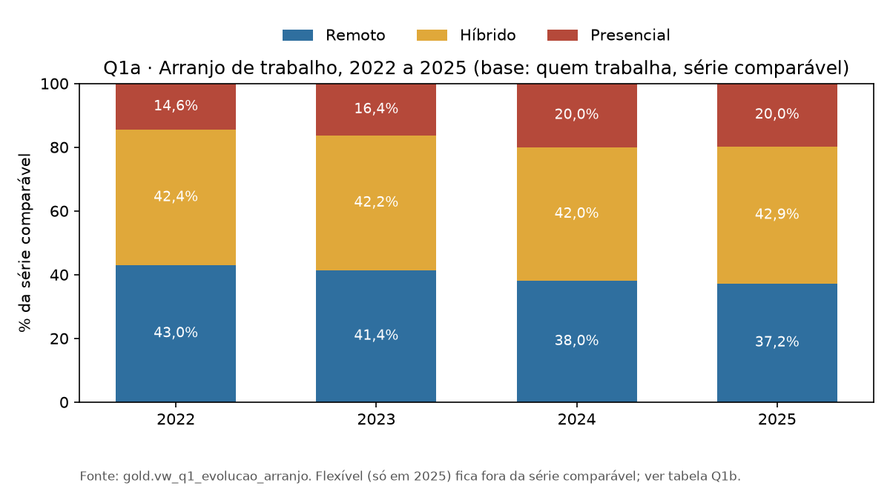

Fonte: elaborado pelo autor (2026), com base nos dados do projeto.

### 1.2 Q1b · A opção nova de 2025

Em 2025, o questionário dividiu o híbrido em duas opções, que o de-para reúne em Híbrido. Também acrescentou
Your choice (classificada como `Flexível`), com 3.997 respostas
(12,3% das 32.453 informadas). Os dados não permitem determinar como essas pessoas se distribuiriam no questionário antigo. Foram calculados os
extremos: tudo em um arranjo, depois tudo fora dele.

**Tabela 1 - Q1b · A opção nova de 2025**

| 2025, conforme a leitura de Your choice | Faixa |
|---|---|
| Remoto | 32,6% a 44,9% |
| Híbrido | 37,6% a 49,9% |
| Não presencial | 70,2% a 82,5% |

Fonte: elaborado pelo autor (2026), com base nas fontes e regras indicadas no texto.

Na base de quem trabalha, incluir Your choice no denominador reduz o remoto de 37,2% para 32,6%. A base
`todos_informados` inclui também quem não trabalha: nela, o remoto é 32,4% com Your choice e 37,0% sem essa categoria.

**Figura 2 - Faixa de cada arranjo em 2025 conforme a leitura da opção Your choice**

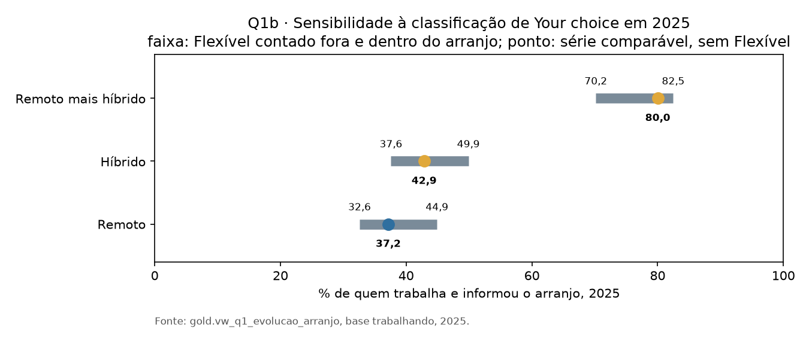

Fonte: elaborado pelo autor (2026), com base nos dados do projeto.

### 1.3 Q1c · A não resposta de 2025

Em 2025, 8.005 das 40.458 pessoas que trabalham (19,8%) deixaram `RemoteWork` em branco. De 2022 a 2024 foram no máximo
0,1% (C02). A não resposta depende do vínculo: 65,3% dos autônomos contra 10,7% dos empregados (C26).

Ela vem em bloco. Das 8.005 pessoas sem arranjo, 7.605 também deixaram em branco `OrgSize` e `ICorPM`, as outras
perguntas sobre a organização. Dessas, 3.718 responderam alguma pergunta de outro tema, então não é só abandono do
questionário. Pode ser que o bloco sobre a organização tenha deixado de aparecer para parte das pessoas, ou que
autônomos passaram a pulá-lo por não se reconhecerem nele. Os arquivos publicados não trazem a lógica de exibição do
questionário, e o dado não separa as duas explicações.

Há uma segunda quebra, no vínculo. `Employment` aceitava várias respostas de 2022 a 2024 e só uma em 2025. Em 2024,
4.679 das 54.848 pessoas que trabalham (8,5%) marcaram empregado e autônomo ao mesmo tempo, com 50,2% de remoto. A correspondência
com as opções de 2025 é desconhecida; foram calculadas as duas classificações.

Autônomos são mais remotos que empregados, e a não resposta reduziu o peso deles na série de 2025 para 6,9%, contra
11,0% (duplos como empregados) ou 19,5% (duplos como autônomos) em 2024.

**Tabela 2 - Q1c · A não resposta de 2025**

| Remoto na série comparável | 2024, duplos como empregados | 2024, duplos como autônomos | 2025 |
|---|---|---|---|
| Empregados | 34,5% (34,1 a 35,0) | 32,9% (32,4 a 33,3) | 34,7% (34,1 a 35,2) |
| Autônomos | 66,1% (64,9 a 67,3) | 59,2% (58,2 a 60,1) | 70,7% (68,7 a 72,7) |
| Todos, padronizado pela composição de 2024 | 38,0% | 38,0% | 38,6% a 41,7% |
| Todos, sem padronização | 38,0% | 38,0% | 37,2% |

Fonte: elaborado pelo autor (2026), com base nas fontes e regras indicadas no texto.

A linha padronizada pesa a taxa de cada vínculo em 2025 pela composição de 2024 (padronização direta, `referencias.md`
§7.3). Dentro de cada vínculo, o remoto de 2025 não fica abaixo do de 2024. No pior caso, com todos os nulos como não
remotos e depois como remotos (`referencias.md` §7.2), o remoto de 2025 fica entre 29,0% e 51,0%.

A queda de 0,8 ponto entre 2024 e 2025 na série bruta cabe na mudança de composição por vínculo. **A padronização não indica queda
do remoto entre 2024 e 2025.** Isso também não prova estabilidade: a padronização supõe que quem não respondeu se parece
com quem respondeu, e os limites de pior caso mostram a incerteza associada às respostas ausentes. Já a queda de 2022 a 2024 não depende desses nulos e
aparece entre empregados nas duas classificações (40,2% para 34,5%, ou 39,0% para 32,9%). A Q2, a Q3 e a Q4 de 2025
usam a mesma base e têm o mesmo problema.

**Figura 3 - Remoto por vínculo em 2024 e 2025, com os limites das duas classificações dos duplos**

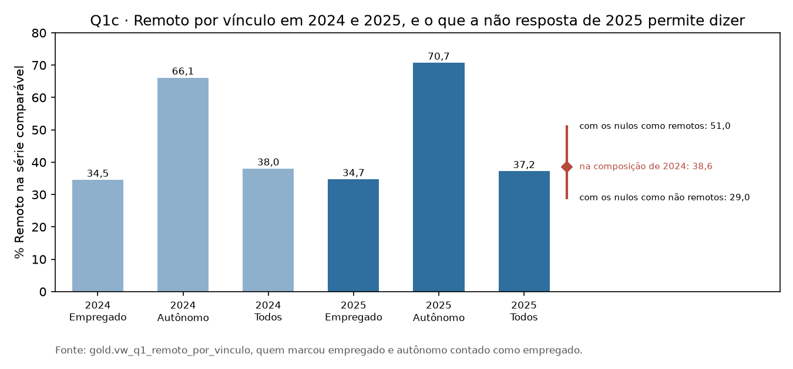

Fonte: elaborado pelo autor (2026), com base nos dados do projeto.

### 1.4 Q1d · O modelo

A padronização controla um fator de cada vez. No notebook 08b, foi ajustada uma regressão logística de remoto (contra
híbrido e presencial) sobre safra, vínculo (empregado, autônomo ou os dois), Brasil e faixa de experiência, com 204.387
respondentes em 110 células (`gold.analise_q1d_modelo_logistico`). A dispersão de Pearson é 5,04, e os
erros-padrão foram corrigidos por ela.

**Tabela 3 - Q1d · O modelo**

| Comparação | Razão de chances | Intervalo de 95% |
|---|---|---|
| 2023 contra 2022 | 0,90 | 0,86 a 0,95 |
| 2024 contra 2022 | 0,80 | 0,76 a 0,85 |
| 2025 contra 2022 | 0,82 | 0,77 a 0,89 |
| 2025 contra 2024 | 1,03 | 0,96 a 1,11 |

Fonte: elaborado pelo autor (2026), com base nas fontes e regras indicadas no texto.

No modelo com vínculo, indicador Brasil/resto do mundo e faixa de experiência, as chances de remoto em 2024 são
cerca de 20% menores que em 2022. Essa razão de chances não equivale a uma redução de 20% na proporção.
O contraste de 2025 com 2024 produz OR 1,0314, IC95% de 0,9573 a 1,1112 e p = 0,416348. Não foi detectada diferença
nesse contraste; o intervalo admite tanto redução quanto aumento das chances. Demonstrar equivalência exigiria
uma margem e um teste próprios.

Autônomos têm 3,54 vezes as odds de remoto dos empregados, brasileiros 2,73 vezes as dos demais, e quem programa há 21
anos ou mais, 1,88 vezes as de quem programa há até 2. O ajuste cobre apenas as características incluídas. O indicador Brasil/resto não controla mudanças na composição
entre os demais países, e o modelo não corrige o viés de seleção.

### 1.5 O que a Q1 diz para o produto

Entre quem trabalha e respondeu, o remoto ou híbrido permanece predominante. Sua participação caiu 5,4 pontos
entre 2022 e 2024. A comparação de 2025 exige cautela pela mudança de questionário e não resposta. O contraste ajustado
não permite afirmar mudança nem equivalência em relação a 2024. A análise não sustenta crescimento automático da demanda.

## 2 Q2 · Arranjo por porte da empresa

Comparando as categorias extremas de porte, empresas maiores apresentam mais trabalho remoto ou híbrido. O percentual é sobre as respostas
informadas do porte, sem Autônomo e Não sabe, com Your choice no denominador em 2025.

**Tabela 4 - Q2 · Arranjo por porte da empresa**

| Porte | Não presencial 2022 | Não presencial 2025 | Híbrido 2022 | Híbrido 2025 |
|---|---|---|---|---|
| Menos de 20 | 79,4% | 66,4% | 36,6% | 28,8% |
| 10.000 ou mais | 92,7% | 73,0% | 51,0% | 47,5% |

Fonte: elaborado pelo autor (2026), com base nas fontes e regras indicadas no texto.

O híbrido tende a aumentar com o porte. O presencial faz o caminho contrário: em 2022, 20,6% nas empresas com menos de 20
pessoas contra 7,3% nas com 10.000 ou mais.

O remoto sozinho cai com o porte desde 2023: 44,6% nas menores contra 36,2% nas maiores em 2023, e 42,8% contra 31,1%
em 2024. Em 2025 vai de 37,6% em `Menos de 20` a 25,5% em `10.000 ou mais`. Em 2022 não havia ordem.

`Menos de 20` junta as faixas 2 a 9 e 10 a 19 (2022 a 2024) com `Less than 20` (2025). Como 2025 tem Your choice no
denominador, a comparação que vale é entre portes dentro da mesma safra.

**Figura 4 - Arranjo de trabalho por porte da empresa em 2025, sem Autônomo e Não sabe**

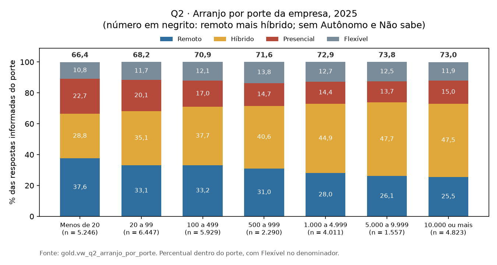

Fonte: elaborado pelo autor (2026), com base nos dados do projeto.

### 2.1 O que isso muda

O maior peso do híbrido nas empresas grandes sugere um segmento para investigação comercial. Esse resultado se refere
ao tamanho da organização informado em `OrgSize`. Equipes pequenas podem pertencer a empresas grandes, portanto a Q2
não confirma nem refuta uma estratégia de venda para times pequenos. A inclusão do híbrido muda a comparação entre
portes em relação a uma análise limitada ao remoto integral.

## 3 Q3 · Brasil comparado ao resto do mundo

Somando remoto e híbrido, o Brasil ficou em 88,9%, 87,6%, 84,3% e 83,6% de 2022 a 2025. O resto do mundo, em 85,3%,
83,5%, 80,8% e 80,6%. O Brasil fica de 3,0 a 4,1 pontos acima.

A diferença grande está na divisão entre remoto e híbrido. O remoto no Brasil foi 66,8% (64,6 a 68,9) em 2022, 65,4%
(63,1 a 67,5) em 2023, 58,7% (55,9 a 61,5) em 2024 e 58,4% (54,3 a 62,3) em 2025. No resto do mundo, 42,2%, 40,8%,
38,2% e 37,1%. A diferença foi de 24,6, 24,6, 20,5 e 21,3 pontos. O híbrido vai no sentido oposto: 22,2% no Brasil
contra 43,1% no resto do mundo em 2022, e 25,3% contra 43,5% em 2025.

A base brasileira de 2025 é pequena (586 na série comparável). As safras 2024 e 2025 foram agregadas como sensibilidade: o remoto
no Brasil fica em 58,6% (56,3 a 60,9; n = 1.802) contra 37,9% (37,5 a 38,2; n = 70.993) no resto do mundo, 20,7 pontos
de diferença. A subamostra brasileira caiu 60,9% entre 2022 (2.109) e 2025 (825).

**Figura 5 - Remoto e remoto mais híbrido no Brasil e no resto do mundo, por safra**

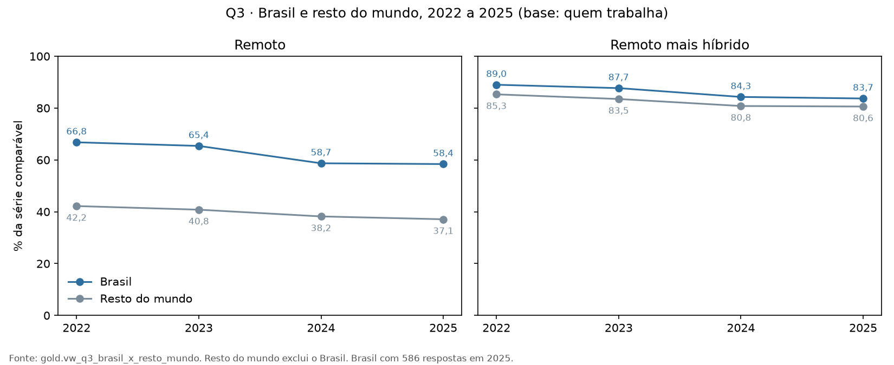

Fonte: elaborado pelo autor (2026), com base nos dados do projeto.

### 3.1 O que isso muda

O foco inicial no Brasil faz sentido. Entre quem respondeu, o Brasil tem mais gente não presencial que o resto do mundo
em todas as safras, e um público muito mais remoto do que híbrido. Uma explicação possível: o brasileiro que responde a
uma pesquisa em inglês tende a trabalhar para empresa de fora. A amostra brasileira é pequena em 2025, e o remoto
brasileiro caiu 8,4 pontos no período. O resultado sugere locais para entrevistas; intenção de compra e disposição a pagar não foram medidas.

## 4 Q4 · Perfis e experiência que concentram trabalho remoto

Em 2025, entre os 29 perfis com pelo menos 100 respostas, os mais remotos foram `Founder, technology or otherwise`
(52,9%; n = 191), `Developer, front-end` (47,1%; n = 1.379), `Developer, game or graphics` (46,3%; n = 244) e
`Developer, mobile` (46,2%; n = 989). Os menos remotos foram `Academic researcher` (11,3%; n = 585), `System
administrator` (14,6%; n = 329), `Developer, embedded applications or devices` (16,2%; n = 970) e `Applied scientist`
(20,3%; n = 202).

Somando o híbrido, os maiores foram engenharia de infraestrutura em nuvem (90,9%), DevOps (89,4%) e gestão de
engenharia (87,2%). Os fundadores ficam em 83,8%. Os menores foram administração de sistemas (55,3%) e sistemas
embarcados (65,9%).

Por anos programando, o remoto sobe de 37,7% (0 a 2) para 49,4% (21 ou mais) em 2022, e de 29,3% (0 a 2) para 42,0%
(21 ou mais) em 2025.

Juntando 2024 e 2025 nos perfis com o mesmo rótulo nas duas safras, a ordem se mantém: `Developer, front-end` 45,7% (n
= 4.362) e `Developer, mobile` 44,8% (n = 2.818) no alto; `System administrator` 19,0% (n = 817), `Developer, embedded
applications or devices` 16,3% (n = 2.500) e `Academic researcher` 11,7% (n = 1.542) embaixo.

O perfil é o primeiro valor de `DevType`, que aceitava várias respostas em 2022 e só uma depois; por isso os perfis de
2022 não se comparam aos seguintes (C30). A experiência é `YearsCode`, que inclui anos de estudo. Perfil e experiência
não foram controlados um pelo outro.

**Figura 6 - Remoto e híbrido por perfil profissional em 2025, perfis com pelo menos 100 respostas**

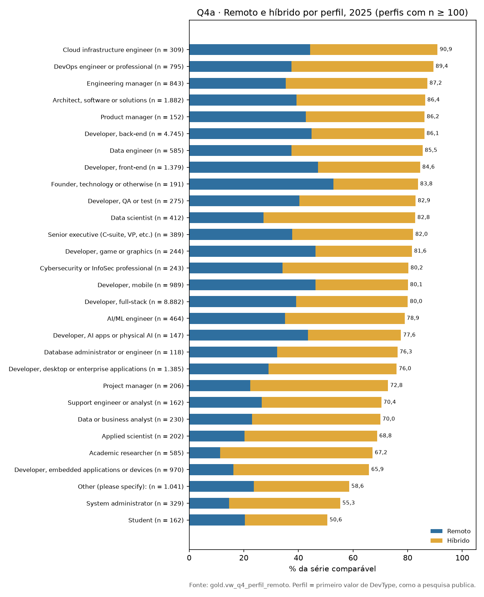

Fonte: elaborado pelo autor (2026), com base nos dados do projeto.

**Figura 7 - Percentual remoto por faixa de anos programando e safra**

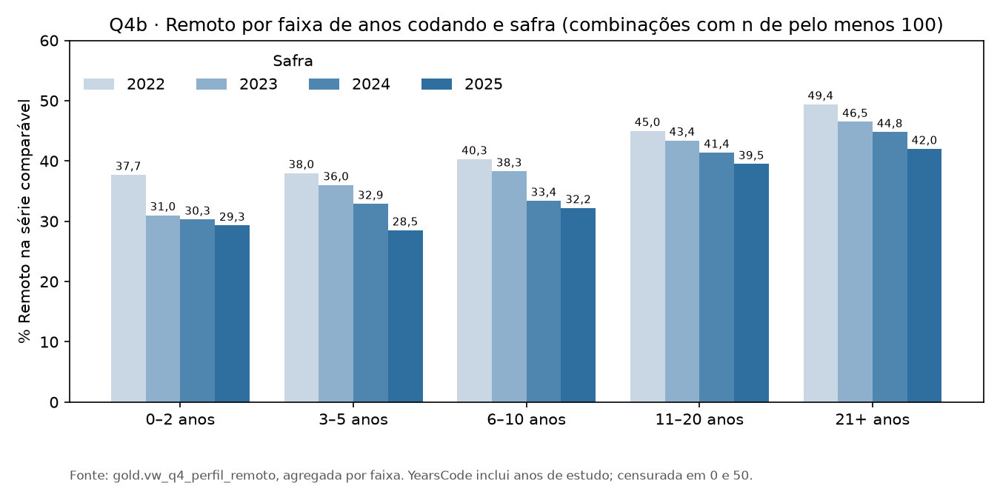

Fonte: elaborado pelo autor (2026), com base nos dados do projeto.

### 4.1 O que isso muda

A distribuição por perfil ajuda a selecionar entrevistados. O remoto integral é frequente entre os fundadores respondentes;
infraestrutura, DevOps e gestão de engenharia se destacam ao incluir o híbrido. Poder de compra não foi medido.
A variável `PurchaseInfluence` da fonte não integra esta análise. Perfil profissional, vínculo e experiência podem
estar associados entre si, por isso essas diferenças não demonstram um efeito independente da ocupação.

## 5 Q5 · Arranjo de trabalho e satisfação

Satisfação média (0 a 10), com erro-padrão e média padronizada por experiência:

**Tabela 5 - Q5 · Arranjo de trabalho e satisfação**

| Safra | Arranjo | n | Média | Erro padrão | Padronizada | Nota 8 a 10 |
|---|---|---|---|---|---|---|
| 2024 | Remoto | 11.103 | 7,07 | 0,020 | 7,05 | 49,4% |
| 2024 | Híbrido | 12.622 | 6,94 | 0,018 | 6,94 | 45,4% |
| 2024 | Presencial | 5.392 | 6,63 | 0,031 | 6,73 | 40,1% |
| 2025 | Remoto | 7.767 | 7,34 | 0,022 | 7,32 | 53,3% |
| 2025 | Híbrido | 8.402 | 7,14 | 0,020 | 7,14 | 48,4% |
| 2025 | Presencial | 3.395 | 6,99 | 0,035 | 7,06 | 45,4% |
| 2025 | Flexível | 2.767 | 7,45 | 0,034 | 7,45 | 56,2% |

Fonte: elaborado pelo autor (2026), com base nas fontes e regras indicadas no texto.

O híbrido fica entre os dois nas duas safras. As medianas de 2024 são iguais, 7 nos três arranjos. A diferença está na
parte de cima da escala.

Entre remoto e presencial, a diferença bruta é de 0,44 ponto em 2024 e 0,35 em 2025. Depois de ajustar por
experiência, cai para 0,32 e 0,26 ponto, e o d de Cohen fica em 0,15 em 2024 e 0,13 em 2025. É um efeito pequeno, mas
se repete nas duas safras.

A pergunta só existe em 2024 e 2025. `JobSat` mede satisfação geral com o emprego, não isolamento nem outra dificuldade
do trabalho a distância. É associação, não causa. Um ensaio randomizado de Bloom, Han e Liang (2024), com 1.612
empregados de uma empresa de tecnologia, vai na mesma direção: o híbrido aumentou a satisfação e reduziu os pedidos de
demissão em um terço (`referencias.md` §8.2).

**Figura 8 - Satisfação média por arranjo em 2024 e 2025, com erro-padrão e média padronizada**

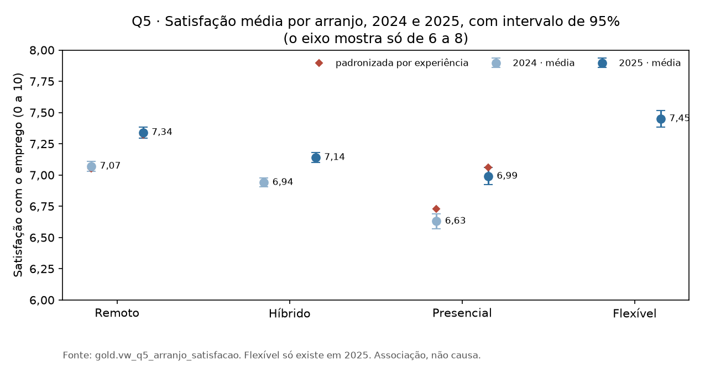

Fonte: elaborado pelo autor (2026), com base nos dados do projeto.

### 5.1 O que isso muda

O Mafia Office pretende atender dificuldades de isolamento, coordenação, reuniões e cultura. Nenhuma é medida
diretamente por estas fontes. Satisfação geral com o emprego pode coexistir com dificuldades de colaboração, portanto
a Q5 não refuta nem confirma essas necessidades. A maior média entre remotos e híbridos impede usar esta amostra
como evidência de insatisfação geral com o trabalho remoto.

## 6 Q6 · Tamanho e distribuição do teletrabalho no Brasil

No 4º trimestre de 2022, das 96.695 mil pessoas ocupadas, 9.462 mil fizeram trabalho remoto (9,8%) e 7.399 mil fizeram
teletrabalho (7,7%), pela linha nacional da tabela 9471. Dentro do teletrabalho, 7.015 mil o fizeram no domicílio.

Por UF, a maior taxa de teletrabalho é a do Distrito Federal, 16,7% (CV 6,3%), seguida de São Paulo, 11,6% (4,1%), e
Rio de Janeiro, 10,2% (4,4%). Entre as UFs com CV até 15%, as menores são Tocantins (3,5%, CV 12,0%), Mato Grosso e
Rondônia (4,1%). São Paulo (2.671 mil), Rio de Janeiro (795 mil) e Minas Gerais (593 mil) somam 54,9% do teletrabalho
das UFs, com 42,5% dos ocupados. Das 27 UFs, 23 têm CV do percentual até 15%.

**Figura 9 - Percentual de teletrabalho por UF em 2022, com intervalo e faixa de CV, e tabela nacional por modalidade**

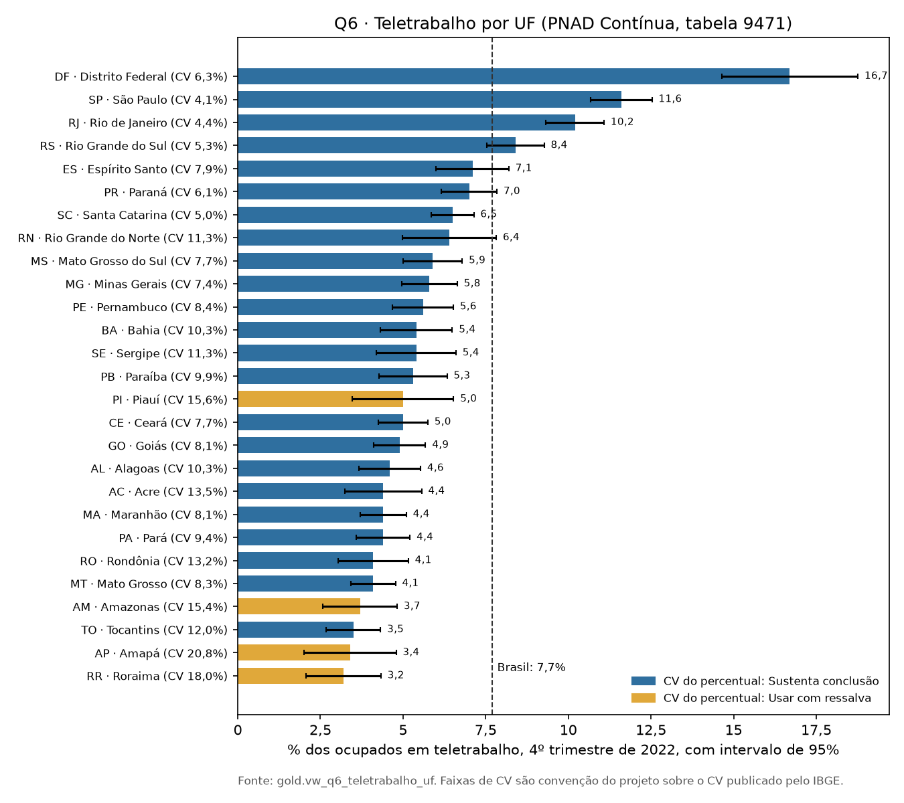

Fonte: elaborado pelo autor (2026), com base nos dados do projeto.

A tabela 9471 é estatística experimental do IBGE, e o recorte carregado neste projeto se limita a 2022. As categorias "fora do
domicílio" e "no domicílio e fora" só valem para Brasil e Grande Região, então ficam fora da análise por UF (C28). As
faixas de CV são critérios deste projeto: até 15% sustenta conclusão, de 15% a 30% vai com ressalva e acima de 30% fica só registrado.

### 6.1 O que isso muda

O teletrabalho está concentrado: três estados têm mais da metade dele. Como a venda é por autoatendimento, isso orienta
onde investir em divulgação e comunidade: São Paulo e Rio pelo volume, o Distrito Federal pela taxa. O dado é de um
único trimestre de 2022.

## 7 Q7 · Ocupação no setor proxy de tecnologia

Somando as UFs, o grupamento proxy foi de 9.488 mil ocupados no 1º trimestre de 2012 para 11.605 mil no 4º trimestre
de 2022 e 13.214 mil no 2º trimestre de 2026. A média móvel de quatro trimestres chegou a 13.142,3 mil no 2º trimestre
de 2026, 2,5% acima do mesmo trimestre de 2025. O crescimento anual desacelerou: era 5,9% no 2º trimestre de 2024. Por
UF, a variação anual vai de -6,7% no Pará a 24,3% no Amapá, e 7 das 27 UFs têm variação negativa.

O proxy é o grupamento 56624 (informação, comunicação e atividades financeiras, imobiliárias, profissionais e
administrativas), bem mais amplo que TI. A tabela 5434 não o abre em partes. Também é um proxy pela atividade da
empresa, não pela ocupação da pessoa: quem programa numa indústria fica fora. Por isso, o número é usado como ordem de
grandeza. A análise usa média móvel porque as estimativas trimestrais por UF não trazem CV nesta consulta.

**Figura 10 - Ocupados no setor proxy de tecnologia, soma das UFs, trimestral e média móvel**

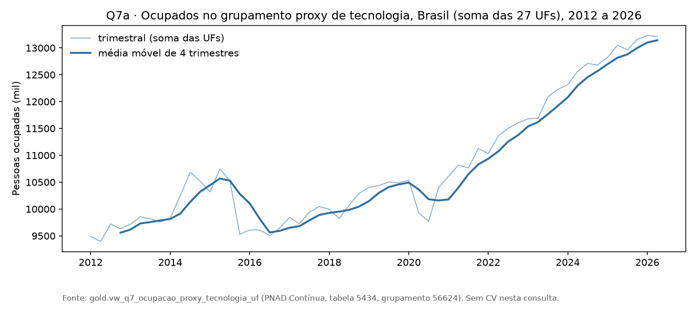

Fonte: elaborado pelo autor (2026), com base nos dados do projeto.

**Figura 11 - Ocupados no setor proxy por UF no último trimestre, com variação anual da média móvel**

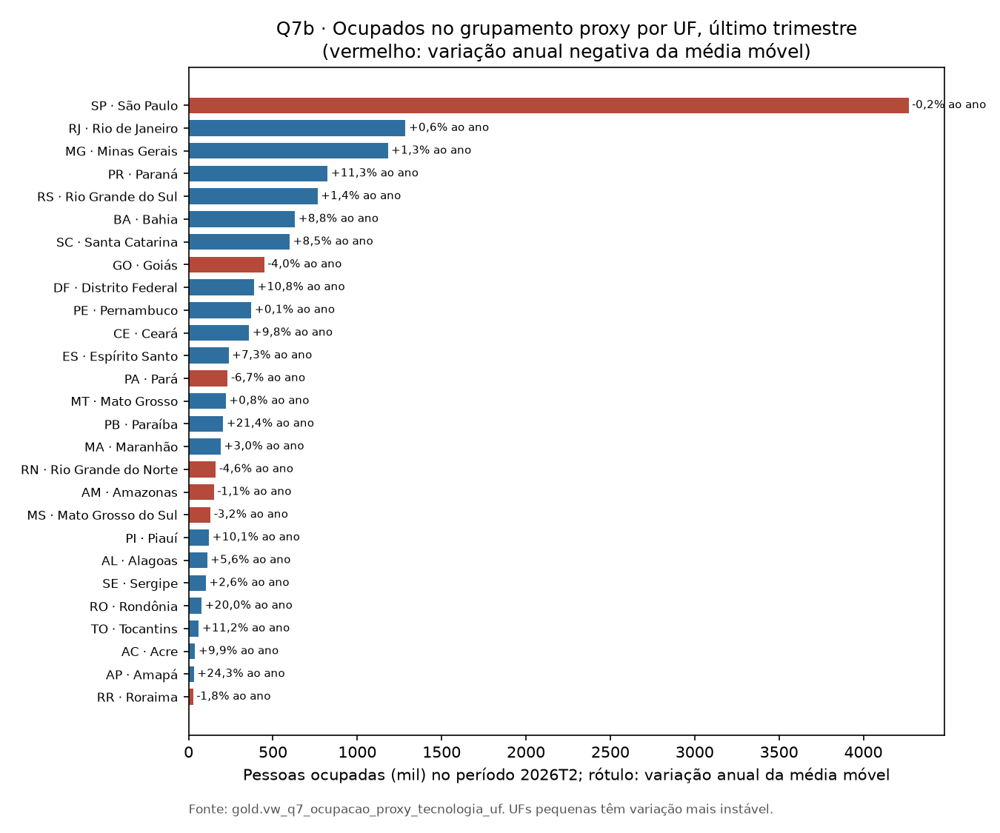

Fonte: elaborado pelo autor (2026), com base nos dados do projeto.

### 7.1 O que isso muda

Esse número é a base dos cenários da Q8. Como argumento de crescimento, é fraco: 2,5% ao ano, desacelerando, e
num setor mais amplo que tecnologia.

## 8 Q8 · Cenários de público no Brasil

Cada cenário multiplica a ocupação do setor proxy no 4º trimestre de 2022 pela taxa de teletrabalho (cenário A) ou de trabalho
remoto (cenário B) do IBGE, nacional ou de cada UF.

**Tabela 6 - Q8 · Cenários de público no Brasil**

| Cenário | Taxa (CV) | Método | Estimativa (mil pessoas) | Intervalo de 95% pela precisão da taxa |
|---|---|---|---|---|
| A. teletrabalho | 7,7% nacional (CV 1,9%) | taxa nacional × proxy do Brasil | 893,6 | 860,3 a 926,9 |
| A. teletrabalho | taxa de cada UF | soma das estimativas por UF | 993,3 | 884,7 a 1.102,0 |
| B. trabalho remoto | 9,8% nacional (CV 1,6%) | taxa nacional × proxy do Brasil | 1.137,3 | 1.101,6 a 1.173,0 |
| B. trabalho remoto | taxa de cada UF | soma das estimativas por UF | 1.241,9 | 1.123,8 a 1.360,1 |

Fonte: elaborado pelo autor (2026), com base nas fontes e regras indicadas no texto.

No cenário A por UF, as maiores estimativas são São Paulo (443,7 mil), Rio de Janeiro (132,6 mil), Minas Gerais (60,4
mil), Rio Grande do Sul (59,3 mil) e Distrito Federal (52,8 mil).

**Figura 12 - As quatro estimativas dos cenários A e B, com o intervalo pela precisão da taxa**

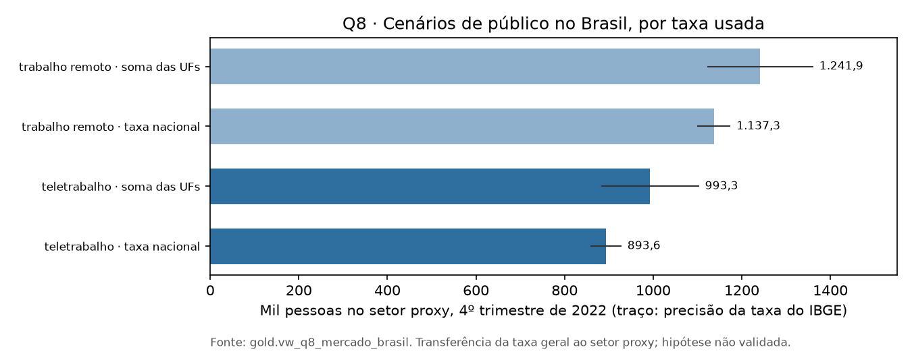

Fonte: elaborado pelo autor (2026), com base nos dados do projeto.

A aplicação de taxas gerais ao setor é uma hipótese. Na divulgação do IBGE, 25,8% das pessoas ocupadas no grupamento
realizaram teletrabalho (referências, §8.3). Esse é um percentual dentro do setor, não sua participação entre todos os
teletrabalhadores. Por isso, não cabe multiplicar o total nacional de teletrabalhadores por 25,8%.
O percentual também não foi aplicado diretamente aos 11.605 mil da tabela 5434: universo e ponderação precisam ser
compatibilizados antes de estimar o total setorial.

A aplicação da taxa de remoto mais híbrido da pesquisa (88,9% dos brasileiros que trabalham, em 2022) foi examinada
e descartada. O resultado, 10.319,7 mil, supera o total de 9.462 mil pessoas em trabalho remoto no país. A comparação
reforça que as definições e bases das duas fontes não são intercambiáveis.

O intervalo cobre só a precisão da taxa do IBGE. Ficam fora o erro do proxy, a transferência da taxa média ao setor e
a pequena diferença de universo entre as tabelas 9471 e 5434 (C25: 821 mil ocupados, 0,85%). A faixa de 860,3 a 1.360,1 mil
envolve os quatro intervalos apresentados, mas não é um intervalo de confiança conjunto para o público do produto.

### 8.1 O que isso muda

Os quatro cenários produzem de 893,6 mil a 1.241,9 mil pessoas sob as hipóteses especificadas. Eles não medem o total
observado de teletrabalho no setor, usuários interessados ou compradores. Para estimar receita seriam necessários,
além de uma medida de público compatível, preço por assento, disposição a pagar, conversão e tamanho das equipes.

## 9 Limitações

**A pesquisa da Stack Overflow não é amostra probabilística.** A metodologia de 2025 registra 49.009 respostas
qualificadas de 177 países, recrutadas principalmente pelos canais da própria Stack Overflow, e reconhece que os
usuários mais engajados tinham mais chance de ver os convites (`referencias.md` §6.2). Os percentuais descrevem a
comunidade que responde. Aumentar o n reduz o erro aleatório, não o viés.

O módulo de teletrabalho do IBGE é pontual e experimental. A tabela carregada não permite descrever a evolução do teletrabalho no Brasil
depois de 2022.

As fontes têm papéis diferentes. A Stack Overflow descreve o arranjo declarado e o perfil dos respondentes. O IBGE mostra tamanho e distribuição
geográfica, com CV publicado. As fontes são analisadas separadamente, com distinção entre "remoto" e "teletrabalho".

Outros cuidados de comparação:

- O questionário de 2025 mudou as opções de arranjo e de vínculo. A análise de 2025 inclui sensibilidades para essa quebra.
- A não resposta de 2025 muda a composição da base informada (Q1c e Q1d).
- A mistura de países, vínculos e perfis muda entre safras. A Q1 ajusta vínculo, indicador Brasil/resto e experiência; a Q5 padroniza por experiência.
- As análises de arranjo usam quem trabalha. Estudantes e desempregados ficam fora.
- `JobSat` não mede nenhuma das dores do produto.
- Na Q8, a transferência das taxas gerais ao setor proxy permanece uma hipótese não validada.

## 10 Discussão geral

As oito perguntas descrevem o trabalho remoto e sugerem segmentos para investigação. A pesquisa mostra que o remoto
ou híbrido é predominante entre os respondentes, com queda até 2024 e comparação limitada em 2025. O IBGE confirma
a existência de teletrabalho em escala nacional no recorte de 2022. Os cenários da Q8 dependem de premissas adicionais
e não demonstram a dimensão da demanda pelo Mafia Office.

O Brasil permanece como mercado inicial proposto. São Paulo e Rio de Janeiro se destacam pelo volume de teletrabalho,
e o Distrito Federal, pela taxa. Empresas com trabalho híbrido e perfis de infraestrutura, DevOps e gestão de
engenharia são candidatos a entrevistas. O tamanho de equipe e a decisão de compra continuam sem medida direta.

A satisfação geral da Q5 não substitui uma investigação de coordenação, isolamento, reuniões ou cultura.
A proposta comercial precisa de entrevistas com equipes brasileiras e de dados de uso do produto para avaliar essas
necessidades e a disposição a pagar. Essa validação é a próxima etapa; não decorre automaticamente dos percentuais
de trabalho remoto.
