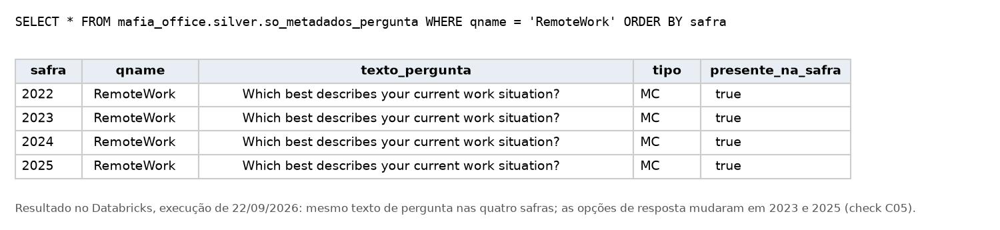

# Fontes, licenças e carga

O pipeline usa só dados públicos. Nenhum dado do Mafia Office, de usuário ou de cliente entra na conta Databricks.
Aqui estão as fontes, a licença de cada uma, a carga no Databricks e o de-para do arranjo de trabalho. O resumo das
fontes está no README.

As três fontes foram extraídas em 13/09/2026 (`2026-09-13T08:04:19Z`). Data, URL, bytes e sha256 de cada arquivo estão em
[`evidencias/EXTRACAO.txt`](../evidencias/EXTRACAO.txt), gerado por `scripts/baixar_fontes.sh`. Se baixar de novo,
compare com esse manifesto, sem substituí-lo.


## 1 Stack Overflow Annual Developer Survey

### 1.1 Onde os dados estão

Em 13/09/2026 as URLs dos ZIPs em `cdn.stackoverflow.co` retornaram HTTP 404. Os arquivos agora estão no repositório
`StackExchange/Survey` do GitHub, em Git LFS. O endereço `raw.githubusercontent.com` devolve um ponteiro de 134 bytes,
e não o dado. O endereço certo é:

```
https://media.githubusercontent.com/media/StackExchange/Survey/main/packages/archive/{ano}/results.csv
https://media.githubusercontent.com/media/StackExchange/Survey/main/packages/archive/{ano}/schema.csv
```

**Quadro 1 - Onde os dados estão**

| Safra | Bytes de `results.csv` | Linhas | Colunas |
|---|---|---|---|
| 2022 | 108.829.270 | 73.268 | 79 |
| 2023 | 158.626.799 | 89.184 | 84 |
| 2024 | 159.525.875 | 65.437 | 114 |
| 2025 | 140.893.245 | 49.191 | 172 |

Fonte: elaborado pelo autor (2026), com base nas fontes e regras indicadas no texto.

### 1.2 Licença e citação

A página da pesquisa publica os resultados sob ODbL 1.0, com o conteúdo das células sob DbCL 1.0. O repositório traz a
Apache 2.0 no `LICENSE.md`, mas o `README.md` dele separa as duas: os dados ficam sob ODbL e DbCL, e a Apache 2.0 cobre
o resto do repositório (`referencias.md` §6.9). Os microdados são atribuídos à fonte sob a ODbL. Não foi identificado formato de citação
obrigatório nas páginas consultadas. A atribuição usada no projeto é:

```
Fonte: Stack Overflow Annual Developer Survey {ano}, licenciado sob ODbL 1.0.
```

### 1.3 Metodologia

A página de metodologia de 2025 (`referencias.md` §6.2) registra:

- 49.009 respostas qualificadas, de 177 países;
- campo de 29 de maio a 23 de junho de 2025;
- cerca de 15.000 respostas descartadas pelas perguntas de qualificação;
- recrutamento principalmente por canais da própria Stack Overflow, com uma campanha no Reddit respondendo por menos
  de 2%;
- o viés: por esse recrutamento, os usuários mais engajados tinham mais chance de ver os convites.

A página não diz se a amostra representa a população de desenvolvedores. O microdado de 2025 tem 49.191 linhas, 182 a
mais que as 49.009 respostas qualificadas, e a página não explica a diferença. A diferença é registrada na verificação C16, sem
atribuir causa.


## 2 IBGE, via API do SIDRA

A API do SIDRA é pública, sem chave e sem cadastro. Os microdados da PNAD ficaram fora do escopo: sua adoção exigiria leitura de largura fixa,
dicionário em `.xls` e pesos amostrais, e isso não cabia no prazo.

### 2.1 Tabela 9471

Pessoas de 14 anos ou mais ocupadas, por realização de trabalho remoto e teletrabalho. O módulo de teletrabalho foi
divulgado para 2022, referência temporal adotada neste projeto (`referencias.md` §6.4). Pela descrição no SIDRA
(`referencias.md` §6.8), a fonte é a PNAD Contínua anual do 4º trimestre, e a nota diz que são "estatísticas
classificadas como experimentais e devem ser usadas com cautela". A mesma nota traz duas restrições que o pipeline
trata:

- "Exclusive as pessoas ocupadas que estavam afastadas do trabalho": o universo é diferente do da 5434 (verificação
  C25);
- a classificação "está disponível apenas para os níveis territoriais Brasil e Grande Região nas categorias Realizou
  teletrabalho fora do domicílio e Realizou teletrabalho no domicílio e fora do domicílio". A API devolve valor para
  essas duas categorias por UF, e essas 54 linhas ficam com `disponivel_no_nivel = false` (verificação C28).

```
https://apisidra.ibge.gov.br/values/t/9471/n1/all/n3/all/v/4090,4091,12965,12966/p/2022/c1675/all/d/m
```

Peço Brasil (`n1`) e UF (`n3`) numa consulta só. Assim a linha nacional publicada, com o próprio coeficiente de
variação, serve de validação externa. Variáveis: 4090 (pessoas, em mil), 4091 (CV de pessoas), 12965 (percentual do
total de ocupados) e 12966 (CV do percentual). A resposta tem 673 registros (cabeçalho + 28 territórios × 6
modalidades × 4 variáveis).

### 2.2 Tabela 5434

Pessoas de 14 anos ou mais ocupadas, por grupamento de atividade no trabalho principal, trimestral, de 2012T1 a 2026T2.
A nota da tabela diz que, "a partir de 15 de agosto de 2025, as estimativas deste tema passaram a ser divulgadas com
base na nova ponderação da pesquisa, conforme a Nota Técnica 02/2025". A extração do projeto é posterior a essa data.

```
https://apisidra.ibge.gov.br/values/t/5434/n3/all/v/4090/p/201201-202602/c888/all
```

O período foi fixado em `201201-202602` (58 trimestres) para a consulta devolver o mesmo resultado em qualquer data. A
resposta tem 20.359 registros (cabeçalho + 27 UF × 13 grupamentos × 58 trimestres) e cerca de 8,26 MB. O download usa
timeout de 180 s. Os 13 grupamentos incluem o Total (47946) e a Indústria de transformação (60031), que está dentro da
Indústria geral (47948). Por isso os grupamentos não se somam livremente (verificação C24).

### 2.3 Parâmetros da API

Os valores padrão da API estão em `referencias.md` §6.5.

**Quadro 2 - Parâmetros da API**

| Parâmetro | Efeito | Decisão |
|---|---|---|
| `/h/y` (padrão) · `/h/n` | Inclui ou suprime o registro de cabeçalho | Foi mantida a opção padrão: o cabeçalho vem na Bronze e sai na Silver, onde dá para ver |
| `/f/a` (padrão) | Códigos e nomes dos descritores | Mantido: códigos viram chaves, nomes viram atributos de dimensão |
| `/d/m` (padrão `/d/s`) | Precisão decimal máxima | Usado na 9471, por causa do percentual e do coeficiente de variação |
| `/v` e `/p` (padrões `allxp` e `last`) | Variáveis e períodos | Fixados nas URLs: `allxp` exclui percentuais e `last` mudaria a cada divulgação |
| Limite de 100.000 valores por consulta | Calculado pelo produto da quantidade de elementos selecionados em cada dimensão, não pelo número de linhas do retorno | 5434: 27 UF × 13 grupamentos × 1 variável × 58 trimestres = 20.358 valores; 9471: 28 territórios × 6 modalidades × 4 variáveis × 1 período = 672 |

Fonte: elaborado pelo autor (2026), com base nas fontes e regras indicadas no texto.

### 2.4 Sinais nas células

Os sinais seguem as Normas de apresentação tabular do IBGE (`referencias.md` §6.6). O notebook 04 trata os cinco:

**Quadro 3 - Sinais nas células**

| Sinal | Significado, literal | Valor na Silver | Coluna de sinal |
|---|---|---|---|
| `-` | "Dado numérico igual a zero não resultante de arredondamento" | 0 | `-` |
| `..` | "Não se aplica dado numérico" | nulo | `..` |
| `...` | "Dado numérico não disponível" | nulo | `...` |
| `x` | "Dado numérico omitido a fim de evitar a individualização da informação" | nulo | `x` (verificação C27) |
| `0` / `0,0` | "Dado numérico igual a zero resultante de arredondamento" | 0 | nulo (é número publicado) |

Fonte: elaborado pelo autor (2026), com base nas fontes e regras indicadas no texto.

Qualquer outro texto sem número interrompe o notebook 04. No dado extraído só aparece `-`: em 28 células da 9471 (CV
do percentual do Total) e em 909 da 5434 (grupamento Atividades mal definidas).

### 2.5 Licença: não confirmada

A página de direitos autorais do IBGE (`/acesso-informacao/institucional/direitos-autorais.html`) respondeu HTTP 403
em 13/09/2026. Em 23/09/2026, no navegador, o 403 era um desafio da Cloudflare e, passado o desafio, vinha a página 404
do portal. O Termo de Uso do portal trata de dados pessoais e não declara licença para as estatísticas.

São estatísticas públicas de um órgão federal, distribuídas sem cadastro nem chave. A Lei de Acesso à Informação
(`Lei 12.527/2011`) e a Política de Dados Abertos (`Decreto 8.777/2016`) tratam esse tipo de dado como aberto, e as
publicações do IBGE permitem a reprodução com a fonte citada. Por isso, o IBGE é citado em todas as tabelas e views
derivadas.

### 2.6 Citação

Tabela 9471:

```
IBGE. Pesquisa Nacional por Amostra de Domicílios Contínua: módulo Teletrabalho e
trabalho por meio de plataformas digitais, 2022. Tabela SIDRA 9471. Estatísticas
experimentais. Acesso via API do SIDRA em {data}.
```

Tabela 5434, no mesmo padrão (formato adaptado para este projeto):

```
IBGE. Pesquisa Nacional por Amostra de Domicílios Contínua. Tabela SIDRA 5434:
pessoas de 14 anos ou mais de idade ocupadas, por grupamentos de atividade no
trabalho principal. Acesso via API do SIDRA em {data}.
```


## 3 Carga sem depender de rede

Na Free Edition, a saída de internet é restrita a um conjunto limitado de domínios. No fórum da Databricks, usuários
reportaram a falha como erro de DNS (`[Errno -3] Temporary failure in name resolution`), e não como erro HTTP. E, se a
cota de uso estourar, o compute fica desligado pelo resto do dia (`referencias.md` §6.1 e §6.7). Por isso o caminho
principal é:

1. `scripts/baixar_fontes.sh` baixa os arquivos em ambiente local e valida a integridade;
2. os arquivos são enviados para o Volume `mafia_office.bronze.pouso` do Unity Catalog;
3. os notebooks 01 e 02 leem do Volume.

O envio pela interface manda arquivos, não pastas, e os quatro `results.csv` têm o mesmo nome. As
pastas são criadas antes do envio, de `stackoverflow/2022` a `stackoverflow/2025`, `ibge` e `referencia`, e cada arquivo é enviado à pasta correspondente. A listagem
do Volume, feita pela CLI em 24/09/2026, está em [`evidencias/volume-pouso.csv`](../evidencias/volume-pouso.csv).

O notebook 02 aceita também `origem = api`, que chama a API direto quando há saída de rede. O tratamento de erro
captura `RequestException`, que cobre a falha de DNS, e orienta a voltar para o envio manual.

### 3.1 Validações na chegada

- Ponteiro do Git LFS: se um `results.csv` tiver 134 bytes, o script e o notebook 01 interrompem a execução.
- Bytes exatos: cada `results.csv` é comparado ao tamanho medido (108.829.270 · 158.626.799 · 159.525.875 ·
  140.893.245 bytes).
- Linhas e colunas: a Bronze interrompe a execução se as contagens divergirem de 73.268 · 89.184 · 65.437 · 49.191
  linhas (277.080 no total) e 79 · 84 · 114 · 172 colunas.
- SIDRA: 673 registros na 9471 e 20.359 na 5434 (com cabeçalho); a 9471 precisa trazer a linha Brasil.
- `schema.csv`: 79 · 78 · 87 · 139 linhas (383 em `bronze.so_esquema`), registradas sem valor de referência.

### 3.2 Leitura

O schema explícito é montado a partir da primeira linha do CSV, com todas as colunas `STRING`. A leitura dispensa `inferSchema`, que
varre o arquivo inteiro antes de ler. A leitura pelo Spark usa `multiLine` e `escape`, porque as respostas livres têm
vírgula, aspas e quebra de linha. O perfil de captura realiza uma leitura adicional dos CSVs para medir completude e domínios
observados. As transformações seguintes leem as tabelas Delta.


## 4 O de-para do arranjo de trabalho

O texto da pergunta `RemoteWork` é o mesmo nas quatro safras (*"Which best describes your current work situation?"*),
mas os rótulos de remoto e presencial mudaram em 2023: `Fully remote` passou a `Remote` e `Full in-person` passou a
`In-person`. A opção híbrida permaneceu igual de 2022 a 2024. Em 2025, o questionário dividiu o híbrido em duas
opções e acrescentou `Your choice`, com 4.244 respostas e sem equivalente anterior (12,6% das 33.780 respostas
informadas de 2025). O de-para reúne as duas opções de 2025 na categoria Híbrido para comparação com os anos anteriores.

O de-para por safra é um arquivo versionado ([`docs/mapa-de-para-arranjo.csv`](mapa-de-para-arranjo.csv), 15 linhas),
carregado como `silver.so_de_para_arranjo`. O `JOIN` com ele interrompe a execução diante de valor não mapeado, o que
exige revisar o de-para quando entrar a safra 2026. A resposta original fica em `arranjo_trabalho_origem`, e `comparavel_serie`
separa o que entra na série histórica. O de-para harmoniza rótulos, mas não remove o efeito da mudança do questionário.
Por isso, a análise trata 2025 como quebra de instrumento.

**Figura 1 - Texto da pergunta RemoteWork em silver.so_metadados_pergunta, idêntico nas quatro safras**



Fonte: elaborado pelo autor (2026), com base nos dados do projeto.
