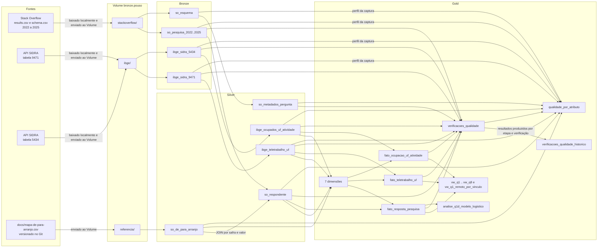

# Linhagem de dados

De onde vem cada coluna do pipeline e que transformação ela sofre entre Bronze, Silver e Gold. O Unity Catalog
mostra quais colunas alimentam quais, mas não a regra aplicada; a regra está aqui. A linhagem registrada pelo Unity
Catalog está em [`evidencias/linhagem-unity-catalog.csv`](../evidencias/linhagem-unity-catalog.csv) (tabelas) e
[`evidencias/linhagem-colunas-unity-catalog.csv`](../evidencias/linhagem-colunas-unity-catalog.csv) (colunas). A
descrição e o domínio de cada coluna estão no [catálogo de dados](catalogo-de-dados.md).

**Figura 1 - Fluxo das fontes, camadas e verificações de qualidade**

Fonte: elaborado pelo autor (2026), com base nas dependências dos notebooks do projeto.

## 1 Fonte → Bronze

Nenhuma transformação de valor. Todas as colunas de dado entram como `STRING`, com o nome original.

**Quadro 1 - Fonte → Bronze**

| Arquivo no Volume | Tabela Bronze | Notebook | O que acontece |
|---|---|---|---|
| `stackoverflow/{ano}/results.csv` | `bronze.so_pesquisa_{ano}` | 01 | Leitura com schema explícito da primeira linha, `multiLine` e `escape`. Todas as colunas preservadas (79, 84, 114, 172). |
| `stackoverflow/{ano}/schema.csv` | `bronze.so_esquema` | 01 | União por nome das quatro safras; coluna ausente numa safra entra nula. |
| `ibge/sidra_9471.json` | `bronze.ibge_sidra_9471` | 02 | Um registro JSON por linha, **incluindo o cabeçalho `d[0]`**; `_ordem_registro` guarda a posição no array. |
| `ibge/sidra_5434.json` | `bronze.ibge_sidra_5434` | 02 | Igual à 9471. |

Fonte: elaborado pelo autor (2026), com base nas fontes e regras indicadas no texto.

Colunas de auditoria de todas as tabelas Bronze:

**Quadro 2 - Fonte → Bronze**

| Coluna | Origem |
|---|---|
| `_sistema_origem` | Constante: `stackoverflow_survey` ou `ibge_sidra` |
| `_ingerido_em` | `current_timestamp()` no momento da gravação |
| `_arquivo_origem` | Caminho do arquivo no Volume, ou URL da API quando `origem = api` |
| `_lote_id` | Identificador gerado por execução (`lote_<UTC>_<hex>`) |
| `_safra` | Ano da safra; 2022 na 9471; nulo na 5434, que cobre vários anos |
| `_ordem_registro` | Só nas tabelas do IBGE: posição do registro no array JSON (0 = cabeçalho) |

Fonte: elaborado pelo autor (2026), com base nas fontes e regras indicadas no texto.

## 2 Bronze → Silver

### 2.1 `silver.so_respondente`

Origem: `bronze.so_pesquisa_2022` a `bronze.so_pesquisa_2025`, unidas por nome. Antes de tudo, `NA` e vazio viram
nulo, e as aspas tipográficas U+2018 e U+2019 viram apóstrofo ASCII nos campos de texto indicados.

**Quadro 3 - silver.so_respondente**

| Coluna Silver | Coluna(s) Bronze | Transformação |
|---|---|---|
| `safra` | `_safra` | Constante por tabela de origem |
| `resposta_id` | `ResponseId` | `try_cast` para `BIGINT`; nulo derruba o notebook |
| `e_profissional` | `MainBranch` | Normalização Unicode; igual a `I am a developer by profession` |
| `empregado` | `Employment` | Normalização Unicode; algum item é `Employed` (2025) ou começa com `Employed,` (2022 a 2024); regex `(^\|;)\s*Employed(,\|;\|$)` |
| `autonomo` | `Employment` | Algum item é `Independent contractor, freelancer, or self-employed` |
| `trabalhando` | `Employment` | `empregado OR autonomo`; base das análises de arranjo |
| `arranjo_trabalho_origem` | `RemoteWork` | **Nenhuma**: cópia fiel, inclusive `NA` |
| `arranjo_trabalho` | `RemoteWork` + `silver.so_de_para_arranjo` | `NA`/vazio para nulo; `JOIN` por `(safra, valor)` com nulo casando nulo; valor sem par derruba o notebook |
| `comparavel_serie` | `arranjo_trabalho` | Fora de `Flexível` e `Não informado` |
| `pais` | `Country` | `NA`/vazio para nulo, normalização Unicode, `trim` |
| `e_brasil` | `pais` | Igual a `Brazil` |
| `porte_empresa_origem` | `OrgSize` | `NA`/vazio para nulo, normalização Unicode |
| `porte_empresa` | `OrgSize` | Mapa fixo de rótulo para faixa canônica; `2 to 9`, `10 to 19` e `Less than 20` viram `Menos de 20` |
| `porte_ordem` | `OrgSize` | Mesmo mapa, ordem 1 a 9 |
| `perfil_principal` | `DevType` | Normalização Unicode; primeiro item antes de `;`, com `trim` (multi-resposta só em 2022; resposta única de 2023 a 2025) |
| `anos_codando` | `YearsCode` | `Less than 1 year` → 0; `More than 50 years` (2022 a 2024) e número acima de 50 (2025, sem teto) → 50; demais `try_cast` para `INT`; negativo → nulo |
| `faixa_experiencia` | `YearsCode` (via `anos_codando`) | Faixas `0–2`, `3–5`, `6–10`, `11–20`, `21+` |
| `remuneracao_usd` | `ConvertedCompYearly` | `try_cast` para `DOUBLE`; câmbio da safra mantido |
| `remuneracao_outlier` | `ConvertedCompYearly` (via `remuneracao_usd`) | Fora de [1.000; 1.000.000]; marca, não remove |
| `satisfacao_trabalho` | `JobSat` | Ausente em 2022 e 2023 (nulo tipado); `try_cast` para `DOUBLE`; fora de 0 a 10 → nulo |
| `_ingerido_em` | `_ingerido_em` | Propagado |

Fonte: elaborado pelo autor (2026), com base nas fontes e regras indicadas no texto.

As colunas que não seguem para a Silver continuam na Bronze para análises futuras (por exemplo `YearsCodePro`,
`Industry`, `Currency`, `EdLevel`, `Age` e `ICorPM`). A Silver seleciona; a Bronze não descarta nada.

### 2.2 `silver.so_de_para_arranjo`

**Quadro 4 - silver.so_de_para_arranjo**

| Coluna Silver | Origem | Transformação |
|---|---|---|
| `safra` | CSV `safra` | `todas` → nulo; demais para `INT` |
| `valor_origem` | CSV `valor_origem` | Campo vazio lido como nulo |
| `valor_canonico` | CSV `valor_canonico` | Nenhuma |
| `entra_serie_historica` | CSV `entra_serie_historica` | Texto `true`/`false` para `BOOLEAN` |
| `observacao` | CSV `observacao` | Nenhuma |

Fonte: elaborado pelo autor (2026), com base nas fontes e regras indicadas no texto.

### 2.3 `silver.so_metadados_pergunta`

**Quadro 5 - silver.so_metadados_pergunta**

| Coluna Silver | Origem (`bronze.so_esquema`) | Transformação |
|---|---|---|
| `safra` | `_safra` | Produto cartesiano de todos os `qname` com as quatro safras |
| `qname` | `qname` | Nenhuma; linhas com `qname` nulo ignoradas |
| `texto_pergunta` | `question` | Menor valor por `(safra, qname)` |
| `tipo` | `type` | Menor valor por `(safra, qname)` |
| `presente_na_safra` | `question` | `texto_pergunta` não nulo |

Fonte: elaborado pelo autor (2026), com base nas fontes e regras indicadas no texto.

### 2.4 `silver.ibge_teletrabalho_uf`

Origem: `bronze.ibge_sidra_9471`, só registros com `_ordem_registro > 0`. O papel de cada par `DnC`/`DnN` vem do
rótulo do cabeçalho (`Variável`, `Ano`, território, classificação). Regra de sinais das medidas: `-` → 0; `..`, `...`
e `x` → nulo; demais `try_cast` para `DOUBLE`. Cada coluna `*_sinal` guarda o sinal convencional da célula (`-`, `..`,
`...`, `x`) ou nulo quando há número; `outro` interrompe o notebook.

**Quadro 6 - silver.ibge_teletrabalho_uf**

| Coluna Silver | Campo Bronze | Transformação |
|---|---|---|
| `nivel_territorial` | `NC` | `1` → `pais`; `3` → `uf`; outro valor derruba o notebook |
| `uf_codigo` | `DnC` territorial | Nenhuma |
| `uf_nome` | `DnN` territorial | Nenhuma |
| `ano` | `DnC` de período | Quatro primeiros caracteres para `INT` |
| `modalidade_codigo` | `DnC` da classificação `c1675` | Nenhuma |
| `modalidade` | `DnN` da classificação `c1675` | Nenhuma |
| `pessoas_mil`, `pessoas_mil_sinal` | `V` onde variável = 4090 | Regra de sinais; pivot |
| `cv_pessoas`, `cv_pessoas_sinal` | `V` onde variável = 4091 | Regra de sinais; pivot |
| `cv_pessoas_classificacao` | (via `cv_pessoas`) | Seis faixas de CV adotadas no projeto (convenção) |
| `percentual`, `percentual_sinal` | `V` onde variável = 12965 | Regra de sinais; pivot |
| `cv_percentual`, `cv_percentual_sinal` | `V` onde variável = 12966 | Regra de sinais (o CV do Total vem publicado como `-`); pivot |
| `cv_classificacao` | (via `cv_percentual`) | Seis faixas de CV adotadas no projeto (convenção) |
| `estimativa_confiavel` | (via `cv_percentual`) | CV até 15 (limiar do projeto) |
| `disponivel_no_nivel` | `NC` e `DnC` da classificação | `false` para 59807 e 59808 por UF, que o IBGE declara só para Brasil e Grande Região |
| `e_experimental` | nenhuma | Constante `true` (nome da tabela 9471 no SIDRA) |

Fonte: elaborado pelo autor (2026), com base nas fontes e regras indicadas no texto.

### 2.5 `silver.ibge_ocupados_uf_atividade`

Origem: `bronze.ibge_sidra_5434`, só registros com `_ordem_registro > 0`. Mesma regra de sinais da 9471.

**Quadro 7 - silver.ibge_ocupados_uf_atividade**

| Coluna Silver | Campo Bronze | Transformação |
|---|---|---|
| `uf_codigo` | `DnC` territorial | Nenhuma |
| `uf_nome` | `DnN` territorial | Nenhuma |
| `ano` | `DnC` de período | Caracteres 1 a 4 para `INT` |
| `trimestre` | `DnC` de período | Caracteres 5 e 6 para `INT` |
| `periodo_codigo` | `DnC` de período | Nenhuma (`AAAATT`) |
| `atividade_codigo` | `DnC` da classificação `c888` | Nenhuma |
| `atividade_nome` | `DnN` da classificação `c888` | Nenhuma |
| `e_proxy_tecnologia` | `DnC` da classificação `c888` | Igual a `56624` |
| `pessoas_mil`, `pessoas_mil_sinal` | `V` (variável 4090) | Regra de sinais |

Fonte: elaborado pelo autor (2026), com base nas fontes e regras indicadas no texto.

## 3 Silver → Gold: dimensões

**Quadro 8 - Silver → Gold: dimensões**

| Dimensão | Colunas | Origem na Silver | Transformação |
|---|---|---|---|
| `dim_periodo` | `periodo_chave`, `tipo_periodo`, `ano`, `trimestre`, `rotulo` | `so_respondente.safra`, `ibge_teletrabalho_uf.ano`, `ibge_ocupados_uf_atividade.ano` e `trimestre` | Distintos; `periodo_chave` = `ano×10` ou `ano×10+trimestre`; membro `-1` |
| `dim_geografia` | `geo_chave`, `nivel`, `codigo`, `nome`, `pais_nome`, `uf_sigla`, `regiao` | `so_respondente.pais`; `uf_codigo` e `uf_nome` das duas tabelas IBGE | Países com nome em inglês; UFs com `pais_nome = Brazil`; sigla e região por tabela de referência do código IBGE; chave por `xxhash64` de (nivel, codigo); membros `-1` e `-2` |
| `dim_arranjo_trabalho` | `arranjo_chave`, `arranjo`, `entra_serie_historica`, `ordem` | `so_de_para_arranjo.valor_canonico` e `entra_serie_historica` | Distintos com ordem canônica fixa; membro `-1` |
| `dim_porte_empresa` | `porte_chave`, `porte`, `ordem`, `faixa_min`, `faixa_max` | Mesmo domínio de `so_respondente.porte_empresa` | Lista fixa das nove faixas com limites dos rótulos; membros `-1` e `-2` |
| `dim_perfil_dev` | `perfil_chave`, `perfil`, `faixa_experiencia` | `so_respondente.perfil_principal` e `faixa_experiencia` | Pares distintos, nulo como `Não informado`; chave por `xxhash64` de (perfil, faixa); membro `-1` |
| `dim_modalidade_ibge` | `modalidade_chave`, `modalidade`, `e_teletrabalho`, `modalidade_codigo`, `modalidade_pai_codigo` | `ibge_teletrabalho_uf.modalidade_codigo` e `modalidade` | Distintos por código; `e_teletrabalho` para 59805 a 59808; hierarquia fixa verificada no C23; membro `-1` |
| `dim_atividade_economica` | `atividade_chave`, `codigo`, `nome`, `e_proxy_tecnologia`, `e_total`, `e_subgrupamento` | `ibge_ocupados_uf_atividade.atividade_codigo`, `atividade_nome`, `e_proxy_tecnologia` | Distintos por código; `e_total` = 47946 e `e_subgrupamento` = 60031, verificados no C24; membro `-1` |

Fonte: elaborado pelo autor (2026), com base nas fontes e regras indicadas no texto.

## 4 Silver → Gold: fatos

Toda chave estrangeira é resolvida por `LEFT JOIN`: valor sem par na dimensão vai para `-1`; em `geo_chave` e
`porte_chave`, campo em branco na fonte vai para `-2`. A verificação C15 garante `COUNT(*)` igual entre a Silver e
cada tabela fato e zero linhas em `-1`.

### 4.1 `gold.fato_resposta_pesquisa` ← `silver.so_respondente`

**Quadro 9 - gold.fato_resposta_pesquisa ← silver.so_respondente**

| Coluna Gold | Origem | Regra de busca na dimensão ou transformação |
|---|---|---|
| `periodo_chave` | `safra` | `dim_periodo` com `tipo_periodo = 'ano'` e `ano = safra` |
| `geo_chave` | `pais` | `dim_geografia` com `nivel = 'pais'` e `codigo = pais`; país nulo → `-2` |
| `arranjo_chave` | `arranjo_trabalho` | `dim_arranjo_trabalho.arranjo` |
| `porte_chave` | `porte_empresa`, `porte_empresa_origem` | `dim_porte_empresa.porte`; `OrgSize` em branco → `-2`; rótulo sem mapeamento → `-1` |
| `perfil_chave` | `perfil_principal`, `faixa_experiencia` | `dim_perfil_dev` pelo par, nulo como `Não informado` |
| `safra`, `resposta_id` | idem | Dimensões degeneradas, sem transformação |
| `e_profissional`, `empregado`, `autonomo`, `trabalhando`, `remuneracao_outlier` | idem | Atributos degenerados, sem transformação |
| `qtd_respondentes` | nenhuma | Constante 1 |
| `remuneracao_usd`, `satisfacao_trabalho`, `anos_codando` | idem | Sem transformação |

Fonte: elaborado pelo autor (2026), com base nas fontes e regras indicadas no texto.

### 4.2 `gold.fato_teletrabalho_uf` ← `silver.ibge_teletrabalho_uf`

**Quadro 10 - gold.fato_teletrabalho_uf ← silver.ibge_teletrabalho_uf**

| Coluna Gold | Origem | Regra de busca na dimensão ou transformação |
|---|---|---|
| `periodo_chave` | `ano` | `dim_periodo` com `tipo_periodo = 'ano'` |
| `geo_chave` | `nivel_territorial`, `uf_codigo` | `pais` → linha `Brazil`; `uf` → `dim_geografia` por código |
| `modalidade_chave` | `modalidade_codigo` | `dim_modalidade_ibge.modalidade_codigo` |
| `pessoas_mil`, `pessoas_mil_sinal`, `cv_pessoas`, `cv_pessoas_sinal`, `cv_pessoas_classificacao`, `percentual`, `percentual_sinal`, `cv_percentual`, `cv_percentual_sinal`, `cv_classificacao`, `estimativa_confiavel`, `disponivel_no_nivel` | idem | Sem transformação |

Fonte: elaborado pelo autor (2026), com base nas fontes e regras indicadas no texto.

### 4.3 `gold.fato_ocupacao_uf_atividade` ← `silver.ibge_ocupados_uf_atividade`

**Quadro 11 - gold.fato_ocupacao_uf_atividade ← silver.ibge_ocupados_uf_atividade**

| Coluna Gold | Origem | Regra de busca na dimensão ou transformação |
|---|---|---|
| `periodo_chave` | `ano`, `trimestre` | `dim_periodo` com `tipo_periodo = 'trimestre'` |
| `geo_chave` | `uf_codigo` | `dim_geografia` com `nivel = 'uf'` |
| `atividade_chave` | `atividade_codigo` | `dim_atividade_economica.codigo` |
| `pessoas_mil`, `pessoas_mil_sinal` | idem | Sem transformação |

Fonte: elaborado pelo autor (2026), com base nas fontes e regras indicadas no texto.

## 5 Views: coluna a coluna

Cada view usa a tabela fato e as dimensões das colunas listadas. A `vw_q8_mercado_brasil` combina as três tabelas fato
pelas dimensões conformadas `dim_geografia` e `dim_periodo`, depois de agregar cada uma separadamente.

Todas as views leem da Gold. A segunda coluna diz de qual coluna, ou de qual conta, o valor sai.

### 5.1 `gold.vw_q1_evolucao_arranjo`

**Quadro 12 - gold.vw_q1_evolucao_arranjo**

| Coluna | Origem ou conta |
|---|---|
| `safra` | gold.dim_periodo.ano pela periodo_chave da fato |
| `base` | constante de cada bloco do UNION ALL; trabalhando filtra fato.trabalhando |
| `arranjo`, `ordem`, `entra_serie_historica` | gold.dim_arranjo_trabalho, colunas de mesmo nome |
| `respondentes` | SUM(gold.fato_resposta_pesquisa.qtd_respondentes) por safra, base e arranjo |
| `n_informados` | SUM(respondentes) por safra e base |
| `pct_sobre_informados` | respondentes / n_informados × 100, arredondado |
| `n_serie_comparavel` | SUM(respondentes) com entra_serie_historica, por safra e base |
| `pct_serie_comparavel` | respondentes / n_serie_comparavel × 100 |
| `ic95_inf`, `ic95_sup` | fórmula de Wilson sobre respondentes e n_serie_comparavel |

Fonte: elaborado pelo autor (2026), com base nas fontes e regras indicadas no texto.

### 5.2 `gold.vw_q1_remoto_por_vinculo`

**Quadro 13 - gold.vw_q1_remoto_por_vinculo**

| Coluna | Origem ou conta |
|---|---|
| `safra` | gold.dim_periodo.ano |
| `classificacao_duplos` | constante de cada bloco da view |
| `vinculo` | gold.fato_resposta_pesquisa.empregado e autonomo, conforme classificacao_duplos; Todos soma os dois |
| `trabalhando` | SUM(gold.fato_resposta_pesquisa.qtd_respondentes) com trabalhando verdadeiro |
| `respondentes_duplos` | SUM de qtd_respondentes com empregado e autonomo verdadeiros |
| `nulos_arranjo` | SUM de qtd_respondentes com arranjo Não informado |
| `pct_nulo_arranjo` | nulos_arranjo / trabalhando × 100 |
| `n_serie_comparavel` | SUM de qtd_respondentes com entra_serie_historica |
| `remotos` | SUM de qtd_respondentes com arranjo Remoto |
| `pct_remoto` | remotos / n_serie_comparavel × 100 |
| `ic95_inf`, `ic95_sup` | fórmula de Wilson sobre remotos e n_serie_comparavel |
| `peso_vinculo` | n_serie_comparavel do vínculo / n_serie_comparavel de Todos × 100 |
| `pct_remoto_padronizado_2024` | SUM(pct_remoto da safra × peso_vinculo de 2024) / 100 |
| `remoto_limite_inf_nulos` | remotos / (n_serie_comparavel + nulos_arranjo) × 100 |
| `remoto_limite_sup_nulos` | (remotos + nulos_arranjo) / (n_serie_comparavel + nulos_arranjo) × 100 |

Fonte: elaborado pelo autor (2026), com base nas fontes e regras indicadas no texto.

### 5.3 `gold.vw_q2_arranjo_por_porte`

**Quadro 14 - gold.vw_q2_arranjo_por_porte**

| Coluna | Origem ou conta |
|---|---|
| `safra` | gold.dim_periodo.ano |
| `porte`, `porte_ordem` | gold.dim_porte_empresa.porte e ordem |
| `e_autonomo` | porte igual a Autônomo |
| `arranjo`, `arranjo_ordem` | gold.dim_arranjo_trabalho.arranjo e ordem |
| `respondentes` | SUM(gold.fato_resposta_pesquisa.qtd_respondentes) por safra, porte e arranjo |
| `n_porte` | SUM(respondentes) por safra e porte |
| `pct_no_porte` | respondentes / n_porte × 100 |

Fonte: elaborado pelo autor (2026), com base nas fontes e regras indicadas no texto.

### 5.4 `gold.vw_q3_brasil_x_resto_mundo`

**Quadro 15 - gold.vw_q3_brasil_x_resto_mundo**

| Coluna | Origem ou conta |
|---|---|
| `safra` | gold.dim_periodo.ano |
| `grupo` | gold.dim_geografia.codigo igual ou diferente de Brazil |
| `arranjo`, `ordem`, `entra_serie_historica` | gold.dim_arranjo_trabalho, colunas de mesmo nome |
| `respondentes` | SUM(gold.fato_resposta_pesquisa.qtd_respondentes) por safra, grupo e arranjo |
| `n_informados` | SUM(respondentes) por safra e grupo |
| `n_serie_comparavel` | SUM(respondentes) com entra_serie_historica, por safra e grupo |
| `pct_serie_comparavel` | respondentes / n_serie_comparavel × 100 |
| `ic95_inf`, `ic95_sup` | fórmula de Wilson sobre respondentes e n_serie_comparavel |

Fonte: elaborado pelo autor (2026), com base nas fontes e regras indicadas no texto.

### 5.5 `gold.vw_q4_perfil_remoto`

**Quadro 16 - gold.vw_q4_perfil_remoto**

| Coluna | Origem ou conta |
|---|---|
| `safra` | gold.dim_periodo.ano |
| `perfil`, `faixa_experiencia` | gold.dim_perfil_dev, colunas de mesmo nome |
| `n_informados` | SUM(gold.fato_resposta_pesquisa.qtd_respondentes) com arranjo informado |
| `n_serie_comparavel` | SUM de qtd_respondentes com entra_serie_historica |
| `remotos` | SUM de qtd_respondentes com arranjo Remoto |
| `hibridos` | SUM de qtd_respondentes com arranjo Híbrido |
| `pct_remoto_comparavel` | remotos / n_serie_comparavel × 100 |
| `pct_hibrido_comparavel` | hibridos / n_serie_comparavel × 100 |
| `pct_nao_presencial_comparavel` | (remotos + hibridos) / n_serie_comparavel × 100 |
| `ic95_inf`, `ic95_sup` | fórmula de Wilson sobre remotos e n_serie_comparavel |

Fonte: elaborado pelo autor (2026), com base nas fontes e regras indicadas no texto.

### 5.6 `gold.vw_q5_arranjo_satisfacao`

**Quadro 17 - gold.vw_q5_arranjo_satisfacao**

| Coluna | Origem ou conta |
|---|---|
| `safra` | gold.dim_periodo.ano |
| `arranjo`, `ordem` | gold.dim_arranjo_trabalho, colunas de mesmo nome |
| `n_com_satisfacao` | COUNT(*) das linhas de gold.fato_resposta_pesquisa com satisfacao_trabalho preenchida |
| `satisfacao_media` | AVG(gold.fato_resposta_pesquisa.satisfacao_trabalho) |
| `erro_padrao_media` | STDDEV_SAMP(satisfacao_trabalho) / SQRT(n) |
| `desvio_padrao` | STDDEV_SAMP(satisfacao_trabalho) |
| `satisfacao_media_padronizada` | média por faixa de experiência ponderada pelo peso da faixa na safra |
| `satisfacao_p25`, `satisfacao_mediana`, `satisfacao_p75` | PERCENTILE_CONT(0.25), (0.50) e (0.75) de satisfacao_trabalho |
| `pct_0_a_4` | parcela com satisfacao_trabalho até 4 × 100 |
| `pct_5_a_7` | parcela com satisfacao_trabalho acima de 4 e até 7 × 100 |
| `pct_8_a_10` | parcela com satisfacao_trabalho acima de 7 × 100 |

Fonte: elaborado pelo autor (2026), com base nas fontes e regras indicadas no texto.

### 5.7 `gold.vw_q6_teletrabalho_uf`

**Quadro 18 - gold.vw_q6_teletrabalho_uf**

| Coluna | Origem ou conta |
|---|---|
| `nivel`, `uf_sigla`, `regiao` | gold.dim_geografia, colunas de mesmo nome |
| `territorio` | gold.dim_geografia.nome |
| `modalidade_codigo`, `modalidade`, `modalidade_pai_codigo`, `e_teletrabalho` | gold.dim_modalidade_ibge, colunas de mesmo nome |
| `pessoas_mil`, `cv_pessoas`, `cv_pessoas_classificacao` | gold.fato_teletrabalho_uf, colunas de mesmo nome |
| `leitura_pessoas` | CASE sobre cv_pessoas_classificacao |
| `percentual`, `cv_percentual`, `cv_classificacao` | gold.fato_teletrabalho_uf, colunas de mesmo nome |
| `leitura_percentual` | CASE sobre cv_classificacao |
| `ic95_percentual_inf` | GREATEST(0, percentual × (1 − 1,96 × cv_percentual / 100)) |
| `ic95_percentual_sup` | percentual × (1 + 1,96 × cv_percentual / 100) |

Fonte: elaborado pelo autor (2026), com base nas fontes e regras indicadas no texto.

### 5.8 `gold.vw_q7_ocupacao_proxy_tecnologia_uf`

**Quadro 19 - gold.vw_q7_ocupacao_proxy_tecnologia_uf**

| Coluna | Origem ou conta |
|---|---|
| `uf_sigla`, `uf_nome`, `regiao` | gold.dim_geografia.uf_sigla, nome e regiao |
| `ano`, `trimestre`, `periodo` | gold.dim_periodo.ano, trimestre e rotulo |
| `pessoas_mil` | gold.fato_ocupacao_uf_atividade.pessoas_mil com atividade 56624 |
| `media_movel_4t` | AVG(pessoas_mil) na janela dos quatro trimestres até o atual, por UF |
| `media_movel_4t_ano_anterior` | LAG(media_movel_4t, 4) por UF |
| `variacao_anual_media_movel_pct` | (media_movel_4t / media_movel_4t_ano_anterior − 1) × 100 |

Fonte: elaborado pelo autor (2026), com base nas fontes e regras indicadas no texto.

### 5.9 `gold.vw_q8_mercado_brasil`

**Quadro 20 - gold.vw_q8_mercado_brasil**

| Coluna | Origem ou conta |
|---|---|
| `nivel`, `regiao` | gold.dim_geografia, colunas de mesmo nome |
| `uf_sigla` | gold.dim_geografia.uf_sigla; BR fixo no Brasil |
| `territorio` | gold.dim_geografia.nome |
| `cenario`, `metodo` | constantes de cada bloco da view |
| `taxa_pct` | gold.fato_teletrabalho_uf.percentual (A: 59805, B: 59804); em C, Remoto + Híbrido de brasileiros em fato_resposta_pesquisa 2022 |
| `taxa_cv_classificacao`, `taxa_cv_pct` | gold.fato_teletrabalho_uf.cv_classificacao e cv_percentual |
| `proxy_mil` | gold.fato_ocupacao_uf_atividade.pessoas_mil com atividade 56624 em 2022T4 |
| `estimativa_mil` | proxy_mil × taxa_pct / 100 |
| `estimativa_ic95_inf_mil` | proxy_mil × taxa_pct × (1 − 1,96 × taxa_cv_pct / 100) / 100 |
| `estimativa_ic95_sup_mil` | proxy_mil × taxa_pct × (1 + 1,96 × taxa_cv_pct / 100) / 100 |
| `teto_logico_mil` | gold.fato_teletrabalho_uf.pessoas_mil da modalidade 59804 no território |
| `excede_teto_logico` | estimativa_mil maior que teto_logico_mil |

Fonte: elaborado pelo autor (2026), com base nas fontes e regras indicadas no texto.

## 6 Tabelas geradas pelo próprio pipeline

### 6.1 `gold.analise_q1d_modelo_logistico` ← `gold.fato_resposta_pesquisa` (notebook 08b)

**Quadro 21 - gold.analise_q1d_modelo_logistico ← gold.fato_resposta_pesquisa (notebook 08b)**

| Coluna | Origem ou conta |
|---|---|
| `fator`, `categoria`, `referencia` | Nome do bloco de colunas, categoria e categoria omitida na matriz do modelo |
| `tipo` | `termo` para coeficiente do GLM; `contraste` para diferença entre dois coeficientes de safra |
| `coeficiente`, `erro_padrao`, `p_valor` | GLM binomial sobre as células agregadas por safra, vínculo, Brasil e faixa de experiência; erro-padrão corrigido pela dispersão de Pearson quando ela passa de 1 |
| `razao_de_chances`, `ic95_inf`, `ic95_sup` | `exp(coeficiente)` e `exp(coeficiente ± 1,96 × erro_padrao)` |
| `n_celulas`, `n_respondentes`, `remotos` | Linhas da tabela agregada, soma de `qtd_respondentes` e soma de `qtd_respondentes` em Remoto |
| `dispersao_pearson` | Qui-quadrado de Pearson sobre graus de liberdade do ajuste binomial |

Fonte: elaborado pelo autor (2026), com base nas fontes e regras indicadas no texto.

### 6.2 `gold.verificacoes_qualidade` e `gold.verificacoes_qualidade_historico`

**Quadro 22 - gold.verificacoes_qualidade e gold.verificacoes_qualidade_historico**

| Coluna | Origem ou conta |
|---|---|
| `job_run_id` (só no histórico) | Parâmetro `job_run_id` do job, preenchido com `{{job.run_id}}` |
| `verificacao_id`, `camada`, `tabela`, `atributo`, `dimensao_qualidade`, `dimensao_dama`, `classificacao`, `severidade`, `tratamento` | Argumentos de `registrar()` no notebook 05 (C01 a C30, exceto C15, sobre Bronze e Silver); valores fixos no MERGE do notebook 07 para C15.1 a C15.3, sobre as tabelas fato |
| `resultado` | Comparação entre o valor medido e o esperado declarado |
| `valor_medido`, `linhas_afetadas` | Medição feita nas tabelas Bronze, Silver ou Gold |
| `tipo_regra` | Dicionário `TIPO_REGRA` do notebook 05; `regra` para C15 |
| `executado_em` | Relógio do notebook no momento da verificação |

Fonte: elaborado pelo autor (2026), com base nas fontes e regras indicadas no texto.

Os notebooks 05 e 07 registram somente os resultados produzidos pela etapa e pela execução atual, antes de testar
a reprovação final. O histórico usa a chave (job_run_id, verificacao_id); uma repetição substitui o resultado da mesma
verificação. O notebook 10 apenas exporta os metadados. Verificações ainda não produzidas não são copiadas de runs anteriores.
O Databricks Jobs registra o estado das tarefas, inclusive falhas anteriores à produção das verificações.

### 6.3 `gold.qualidade_por_atributo` ← perfis da captura e as cinco tabelas da Silver (notebook 05b)

**Quadro 23 - gold.qualidade_por_atributo: captura e Silver (notebook 05b)**

| Coluna | Origem ou conta |
|---|---|
| `tabela`, `coluna`, `posicao`, `tipo` | Perfis gravados na captura e schema de cada tabela da Silver |
| `linhas`, `nulos`, `completude_pct` | `COUNT(*)`, soma de `coluna IS NULL` e `(linhas − nulos) / linhas × 100` |
| `unicidade` | Combinações repetidas da chave da tabela; nas outras colunas, `COUNT(DISTINCT coluna)` |
| `regra_consistencia`, `fora_da_regra`, `consistencia_pct` | Lista `REGRAS` do notebook 05b, avaliada nas linhas preenchidas |
| `acuracia` | Lista `ACURACIA` do notebook 05b e o resultado da verificação correspondente em `gold.verificacoes_qualidade` |
| `outliers_iqr`, `limite_inf_iqr`, `limite_sup_iqr` | Regra do intervalo interquartil sobre `percentile_approx` da coluna |
| `executado_em` | Horário do perfil da captura ou do notebook 05b |

Fonte: elaborado pelo autor (2026), com base nas fontes e regras indicadas no texto.
