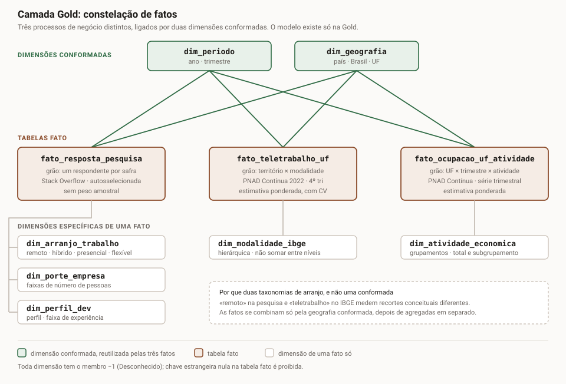
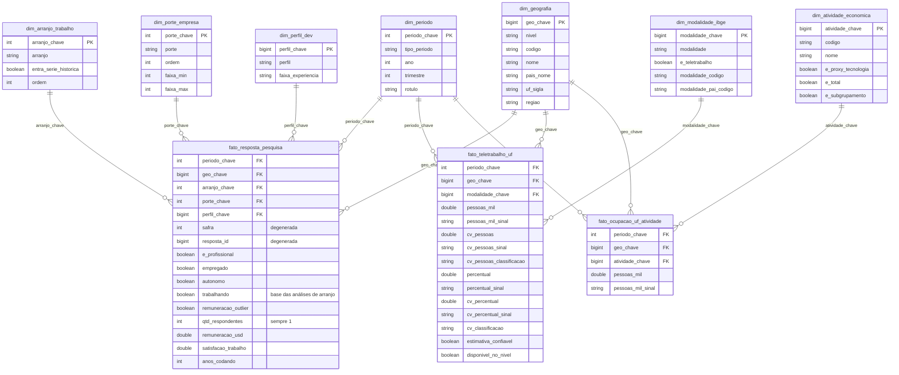

# Modelo dimensional da camada Gold

A Gold tem três tabelas fato, uma para cada processo, ligadas por duas dimensões conformadas (`dim_periodo` e
`dim_geografia`). É o desenho que o Kimball Group descreve como várias tabelas fato ligadas por dimensões conformadas
(`referencias.md` §2.2), também chamado de constelação de fatos. O modelo existe só na Gold. A Silver guarda cada
registro validado e não agregado, sem `dim_` nem `fato_`.

## 1 Diagrama

**Figura 1 - Constelação de fatos da camada Gold: três tabelas fato ligadas pelas dimensões conformadas dim_periodo e dim_geografia**

Fonte: elaborado pelo autor (2026), com base nos dados do projeto.

O SVG mostra o conjunto (também em PNG, em `img/constelacao.png`). O Mermaid abaixo mostra as colunas.

**Figura 2 - Tabelas, colunas e relacionamentos do modelo dimensional**

Fonte: elaborado pelo autor (2026), com base na definição das dimensões e das tabelas fato.

## 2 Grão de cada tabela fato

**Quadro 1 - Grão de cada tabela fato**

| Tabela fato | Grão |
|---|---|
| `fato_resposta_pesquisa` | Uma linha por respondente da Stack Overflow Developer Survey em uma safra. |
| `fato_teletrabalho_uf` | Uma linha por território (Brasil ou UF) e modalidade de trabalho remoto ou teletrabalho, na estimativa da PNAD Contínua de 2022 (4º trimestre). |
| `fato_ocupacao_uf_atividade` | Uma linha por UF, trimestre e grupamento de atividade econômica, na estimativa de pessoas ocupadas da PNAD Contínua. |

Fonte: elaborado pelo autor (2026), com base nas fontes e regras indicadas no texto.

## 3 Matriz de tabelas fato × dimensões

É a matriz de barramento do Kimball Group (`referencias.md` §2.2), transposta: lá os processos ficam nas linhas; aqui
cada tabela fato é um processo e fica numa coluna.

**Quadro 2 - Matriz de tabelas fato × dimensões**

| Dimensão | `fato_resposta_pesquisa` | `fato_teletrabalho_uf` | `fato_ocupacao_uf_atividade` | Conformada |
|---|:---:|:---:|:---:|:---:|
| `dim_periodo` | sim (ano) | sim (ano) | sim (trimestre) | sim |
| `dim_geografia` | sim (país) | sim (Brasil e UF) | sim (UF) | sim |
| `dim_arranjo_trabalho` | sim | | | não |
| `dim_porte_empresa` | sim | | | não |
| `dim_perfil_dev` | sim | | | não |
| `dim_modalidade_ibge` | | sim | | não |
| `dim_atividade_economica` | | | sim | não |

Fonte: elaborado pelo autor (2026), com base nas fontes e regras indicadas no texto.

A `dim_periodo` guarda dois grãos. As linhas de ano têm `trimestre` nulo e chave `ano×10`, e servem à pesquisa e à
9471. As linhas de trimestre têm chave `ano×10+trimestre` e servem à 5434. A coluna `tipo_periodo` diz qual é qual.
Os dois grãos foram reunidos para as três tabelas fato usarem a mesma dimensão de período. O cuidado é filtrar por
`tipo_periodo` antes de contar períodos.

## 4 Hierarquias que impedem somas livres

- **Modalidades da 9471 (verificação C23).** 59804 (trabalho remoto) está contido em 59803 (total); 59805
  (teletrabalho) está contido em 59804; 59806 (no domicílio) e 59807 (fora do domicílio) estão contidos em 59805 e se
  sobrepõem em 59808 (nos dois locais), de modo que 59806 + 59807 − 59808 = 59805. `modalidade_pai_codigo` guarda essa
  hierarquia.
- **Grupamentos da 5434 (verificação C24).** 47946 é o Total, igual à soma dos grupamentos de primeiro nível; 60031
  (Indústria de transformação) está contido em 47948 (Indústria geral). `e_total` e `e_subgrupamento` marcam os dois.
- **Níveis territoriais.** `fato_teletrabalho_uf` tem a linha Brasil e as 27 UFs; somar tudo conta o Brasil duas vezes.

## 5 Decisões de modelagem

- **Uma tabela fato por fonte e grão.** Uma resposta individual autosselecionada e uma estimativa populacional
  ponderada não têm o mesmo grão nem a mesma natureza estatística. Não dá para somá-las numa tabela só.
- **Taxonomias de arranjo separadas.** `dim_arranjo_trabalho` (remoto, híbrido, presencial e flexível, declarados na
  pesquisa) e `dim_modalidade_ibge` (definidas pelo IBGE) medem coisas diferentes. A Q8 agrega cada tabela fato
  separadamente, combina os resultados pela geografia conformada e aplica taxas do IBGE ao setor proxy
  sob premissa de transferência explícita. O cenário com taxa da pesquisa foi descartado por incompatibilidade de bases.
- **Membros especiais.** Toda dimensão tem a linha `-1 / Desconhecido`, usada quando a chave não encontra linha na
  dimensão. `dim_geografia` e `dim_porte_empresa` têm também `-2 / Não informado`, para campo em branco na fonte. A regra
  de não deixar chave estrangeira nula na tabela fato é do Kimball Group; os valores `-1` e `-2` são convenções do projeto. A
  verificação C15 exige zero linhas em `-1`.
- **Chaves substitutas estáveis.** `dim_periodo` usa `ano×10` e `ano×10+trimestre`; `dim_arranjo_trabalho` e
  `dim_porte_empresa` usam a ordem canônica da categoria. As outras quatro usam o `xxhash64` da chave natural, levado a
  inteiro não negativo. A versão inicial usava `ROW_NUMBER()`, mas ele muda todas as chaves quando entra um membro novo. Com o
  hash, a mesma chave natural gera sempre a mesma chave. O notebook 06 para se dois valores gerarem o mesmo hash.
- **Chaves primárias e estrangeiras no Unity Catalog.** Cada dimensão tem chave primária, e cada tabela fato tem chave
  primária no próprio grão e uma chave estrangeira para cada dimensão. São restrições informativas: documentam o modelo
  e geram o diagrama de relacionamento do Catalog Explorer (`referencias.md` §6.12). Quem confere a integridade é a
  verificação C15.
- **Dimensões degeneradas.** `safra` e `resposta_id` ficam na tabela fato da pesquisa para rastrear a linha até a
  Silver. `e_profissional`, `empregado`, `autonomo`, `trabalhando` e `remuneracao_outlier` ficam como filtros na própria
  tabela fato, em vez de uma dimensão lixo (junk), para evitar um `JOIN` sem ganho.
- **Medidas semiaditivas no IBGE.** `pessoas_mil` se soma entre UFs dentro de uma modalidade ou grupamento, nunca entre
  modalidades, grupamentos hierárquicos ou trimestres.
- **Sinais e disponibilidade do IBGE.** Cada medida do IBGE traz `<medida>_sinal` com o sinal convencional da célula, e
  `disponivel_no_nivel` marca as categorias que o IBGE declara disponíveis só para Brasil e Grande Região (C28).
- **Cada medida com seu CV.** `pessoas_mil` usa o CV de pessoas (variável 4091) e `percentual` o CV do percentual
  (variável 12966). Cada um é classificado nas seis faixas de CV adotadas no projeto; as faixas são convenções do projeto, não do IBGE.
